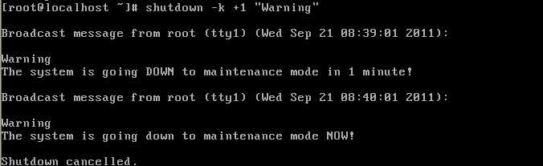

# Linux基础操作 (Week 01)(排版模板一)

## 目的（本次实验所涉及并要求掌握的知识点）

1. 熟悉启动 Linux 虚拟机与同时使用多个控制台登录 Linux 的基本操作；
2. 熟练使用 `date、shutdown、exit、halt、reboot` 等命令；
3. 掌握 shell 中的特殊按键、Linux 中的基本命令；
4. 掌握对文件的备份和恢复。

## 实验内容与设计思想（设计思路、主要数据结构、主要代码结构、主要代码段分析、电路图）

### 实验内容

 1. 练习使用启动 Linux 虚拟机
 2. 练习同时使用多个控制台登录 Linux
 3. 练习使用 `date、shutdown、exit、halt、reboot` 等命令
    1) 使用 `date` 命令修正系统时间，改为当前日期时间
    2) 使用 `shutdown` 命令发出警告信息，查看其他控制台上的用户是否收到信息。
    3) 通过 Internet 查找，是否还有其他的关机命令
 4. 练习操作 shell 中的特殊按键

    在做以下实验之前，用 root 登录到虚拟控制台1（下面简称 vc1），运行命令：
    `useradd mike`，`passwd mike` 添加 mike 用户

    然后用新增加的 mike 用户分别登录虚拟控制台 2 和 3

    在虚拟控制台 3 下用 mike 用户登录成功后，运行如下命令：

    `su`（变换身份到超级用户，需要输入 root 的密码）

 5. 练习所学习的基础命令，完成以下问题：
    1) `logname` 和 `whoami` 的区别，举例说明
    2) 从 vc1 向 vc3 用 `write` 命令发信息，写出这条完整的命令
    3) 假设当前路径为：`/home/mike`，需要变换到绝对路径为 `/etc/default`
       目录下，则该命令用相对路径怎么写？

 6. 用 `tar` 命令实现如下备份和恢复：（备份文件均放在 `/root` 目录下）
    1) 对 `/home` 目录进行压缩备份（采用 `gzip` 压缩），备份文件名为
       `home.tar.gz`
    2) 对 `/home` 目录进行压缩备份（采用 `bzip2` 压缩），备份文件名为
       `home.tar.bz2`，比较二种工具的压缩能力
    3) 在 `/home` 目录下建立文件 `a`，在 /home 目录下建立目录 test，在
       /home/test 目录下建立文件 b（用 vi 编辑任意内容）
    4) 对 /home 目录进行增量备份，备份以来变化的文件，
       备份文件名为 home.20110919.tar
    5) 删除目录 /home，会出现什么情况？然后利用上述备份恢复所有文件。

 7. 填写实验报告单，下周实验课前将电子文档传到服务器上，实验报告单的文件名格式
    为“9.19-xxx实验报告”，xxx 为自己的名字

## 实验使用环境（本次实验所使用的平台和相关软件）

VMware Workstation、Red Hat Enterprise Linux 5

## 实验步骤和调试过程（实验步骤、测试数据设计、测试结果分析）

 1. 启动 Linux 虚拟机和同时多个控制台登录 Linux

    从 VMware 中启动 Red Hat Enterprise Linux 5，当要同时多个控制台登录 Linux
    时按 Ctrl+F1（或 F2\~F9 中任选其一）切换到不同的虚拟机登录同一用户或不同用
    户。通过命令 who 或 w 可以查看显示当前在线的全部用户。
```
x@bodhi:/home/open$ who
x        :0           2015-09-07 08:43 (:0)
x        pts/0        2015-09-07 08:45 (:0.0)
x        pts/1        2015-09-07 08:55 (:0.0)
x        pts/2        2015-09-07 11:55 (:0.0)
x@bodhi:/home/open$ w
 14:57:02 up 13 days,  6:14,  4 users,  load average: 0.05, 0.08, 0.10
USER     TTY      FROM             LOGIN@   IDLE   JCPU   PCPU WHAT
x        :0       :0               07Sep15 ?xdm?   8:53m  9.72s /usr/bin/lxsess
x        pts/0    :0.0             07Sep15 22:29   6.67s  6.58s ssh -X x@172.17
x        pts/1    :0.0             07Sep15 37:33   1:16   1:16  ssh -X x@172.17
x        pts/2    :0.0             07Sep15  7.00s  1.44s  0.00s w
```

 2. 练习使用 date、shutdown、exit、halt、reboot 等命令

    date 时间格式为：MMDDhhmm\[\[CC\]YY\]\[.ss\]

    MM代表月（注意是2位，即2月应写02，以下类似）、DD代表日hh代表时、mm代表分、
    CC代表年份前2位、YY代表年份后2位、ss代表秒

    ```
    x@bodhi:/home/open$ date
    Sun Sep 20 15:00:36 CST 2015
    ```

    shutdown 命令 格式：`shutdown [选项] [时间] [警告信息]`

    一个控制台的用户启动 shutdown 命令后，系统会向所有控制台的用户广播。\
\

    其他退出命令：

    exit 或 logout：用户注销只是切断了当前用户的前台工作，Linux 后台还是在忙碌着，提供正常的服务；

    halt 命令：无需等待立即关闭系统，相当于 `shutdown –h now`；

    reboot 命令：无需等待立即重启系统，相当于 `shutdown –r now`；

 3. 操作 shell 中的特殊按键

    添加 mike 用户，新增加的 mike 用户分别登录虚拟控制台 2 和 3，在虚拟控制台 3 下用 mike 用户登录成功后，运行命令 su  
    （变换身份到超级用户，需要输入 root 的密码）

 4. 练习所学习的基础命令

    logname 和 whoami 的区别  
    logname显示登录系统的用户名字；whoami显示用户当前的身份。
```
root@bodhi:~# logname
x
root@bodhi:~# whoami
root
```

    从 vc1 向 vc3 用 write 命令发信息  
    write 命令格式：`write 用户账号 [终端号]` (写完内容后以 ctrl+d 作为结束)

    当前路径为：/home/mike，需要变换到绝对路径为 /etc/default 目录下，用命令用相对路径写
```
x@bodhi:/home/open$ pwd
/home/open
x@bodhi:/home/open$ cd /
x@bodhi:/$ pwd
/
x@bodhi:/$ cd ./etc/default
x@bodhi:/etc/default$ pwd
/etc/default
x@bodhi:/etc/default$
```

    对 /home 目录进行压缩备份（采用 gzip 压缩），备份文件名为 home.tar.gz

**其他操作内容略，操作结果能拷贝文字的就不要截图**

## 实验小结（实验中遇到的问题及解决过程、实验中产生的错误及原因分析、实验体会和收获）

### 遇到的问题及解决过程

删除 /home 目录后对压缩文件解压，还是不能添加用户或登录原来添加的用户？后来想到 /root 和 /home 是同一级的目录文件，而解压后的 /home 目录在 /root 目录下，于是将 /root 目录下的 /home 目录移到根目录下，问题就解决了。

## 附录（参考文献和相关资料）

(1) 杨明华，谭励，于重重. Linux 系统与网络服务管理技术大全(第二版). 北京：电子工业出版社. 2010 年5 月.

(2) 鸟哥. 鸟哥的 Linux 私房菜——基础篇(在线第三版). <http://vbird.dic.ksu.edu.tw/linux_basic/linux_basic.php>.
