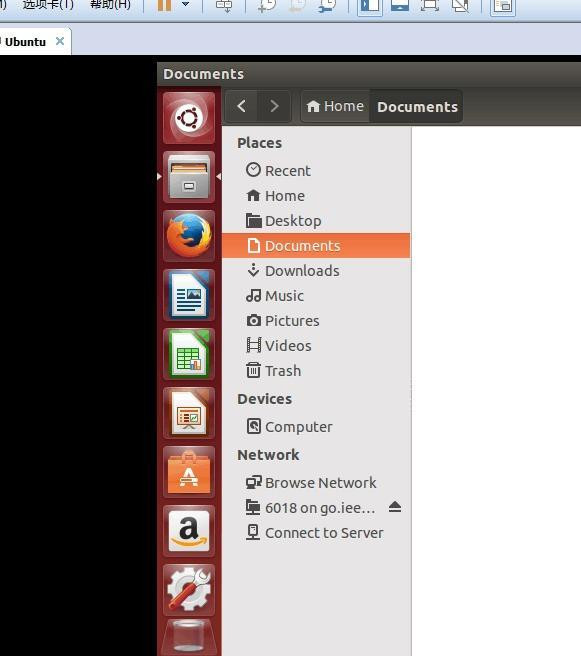

# Linux 英文界面改为中文

日期：2015-09-28 16:33

网址：<http://www.jianshu.com/p/4500b4d27f74>

---

刚安装好的linux，是全英文的，用着颇为不习惯。

所以就把它改中文吧，打开 "system setting"，然后打开 "language supporting"，你
会发现并没有中文，然后在 "install language" 中找到 "Chinese simplified"，点击
下载，之后安装即可。                                           

最后重启一下电脑就 ok 了。

但是在实际操作中自己很多次下载是失败的，后来才发现是没有网的原因。因为之
前在学校用的是校内网，改了网络设置中的 "perference"，所以 Linux 的 wifi 连
不上，改回来就可以了。
