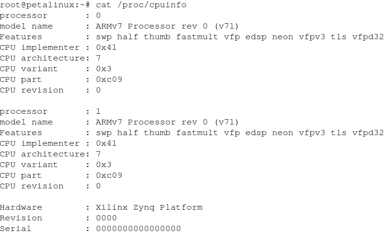

# Zynq Linux 系统介绍

## A First Look

### Introduction

Embedded Linux is the use of a Linux operating system in embedded
systems. Unlike desktop and server versions of Linux, embedded versions
of Linux are designed for devices with relatively limited resources. The
ARM® Cortex™-A9 processor used in Xilinx Zynq® All Programmable SoCs
support embedded Linux. In most of the labs in this workshop, you will
run embedded Linux, build using the PetaLinux tools, on the ARM
Cortex-A9 MPcore.

This first lab is a basic introduction to embedded Linux and the
development board that you are using for the workshop. The basic
activities covered here will be used repeatedly through the later lab
sessions, so be sure to ask your instructor if you have any questions or
concerns.

### Objectives

After completing this lab, you will be able to:

-   Power on the development board used in the workshop

-   Log in to the Zynq Linux system

-   Make comparisons between the embedded Linux and desktop Linux
    environments

### Typographic Conventions

Commands to be executed on the development (desktop) workstation look
like the following:

`[host]$ command and parameters`

Commands to be executed on the ARM processor Linux target look like the
following:

`# run my Linux application`

### Before You Start

Before you start, ensure that the:

-   Power switch is in the 'off' position

-   JTAG cable is connecting the development board to the PC

-   Serial cable is connecting the development board to the PC

-   Power cable for the development board is connected

-   The Ethernet port on the development board connects to the Ethernet
    port of the desktop (host) machine

-   The `BOOT.BIN` and `image.ub` files are copied from the \
    `~/emblnx/sources/lab1/SDCard` directory

-   The SD card is inserted back into the target board.

-   Set the jumpers to boot from the SD card as shown in Fig.\ [@fig:day1jumpserset].

{width="1.5833333333333333in"
height="1.3666666666666667in" #fig:day1jumpserset}

### Initializing the Workshop Environment

By default, your Ubuntu image has already set up the workshop
environment for you.

If your workstation has been restarted or logout, run the following
command to start DHCP server on the host:

`[host] $ sudo service isc-dhcp-server restart`

### General Flow for this Lab

*   Step 1: Power up the Board and Login In
*   Step 2: Explore the Embedded Linux Environment

### Power up the Board and Log in

1.  Power up the board and run the `DHCP` server on the host.

    1)  Power ON the board.

    2)  Run the `DHCP` server:

        `[host] $ sudo service isc-dhcp-server restart`

2.  Set the serial port terminal.

    1)  Ensure that `/dev/ttyACM0` is set to read/write access:

        `[host]$ sudo chmod 666 /dev/ttyACM0`

    2)  In the dashboard, in the Search field, enter the serial port.

    3)  Select the **Serial port terminal** application from the desktop.

    4)  Reset (BTN7) the board to see the booting info.

        Watch the GtkTerm (Serial Port) console as the board goes through the
        boot process. Messages similar to the following can be found in the
        board console as Fig.\ [@fig:day1bootscr1] and Fig.\ [@fig:day1bootscr2].

{#fig:day1bootscr1}

{#fig:day1bootscr2}

### Exploring the Embedded Linux Environment

1.  Explore the booting message and basic Linux commands.

    1)  Scroll up in the terminal window and review the bootup log.
        Existing Linux users should recognize the output.
        You will see `image.ub` loading, drivers loading such as USB,
        SD, etc., and the starting of the uWeb server.

    2)  Log in by entering `root` as both the login and password.

    3)  Spend the next 15 minutes exploring basic Linux commands such as:
        `ls -l, vi, whoami, date`

    4)  Run the following command to list the applications currently
        installed:

        `# ls /bin`

2.  Use the gpio-demo application to test the GPIOs. The gpio-demo
    application is used to write value to the GPIO peripheral or read
    value from the GPIO peripheral.

    1)  Use the following command to see the available GPIOs in
        the system. See Fig.\ [@fig:day1gpioshow]

        `# ls /sys/class/gpio`

        The GPIOs are presented as `gpiochip<ID>` in the directory. Have a
        look at the file `/sys/class/gpio/gpiochip<ID>/label`.

        For example:

        `# cat /sys/class/gpio/gpiochip243/label`

        The GPIO label file contains the GPIO label. The label contains the
        GPIO's physical address information. The GPIO label format is \
        `/amba@0/gpio@<PYHSICAL_ADDRESS>`. As shown in Fig.\ [@fig:day1gpiocatinfo].

        In the ZedBoard system, the on-board GPIOs are: eight LEDs (eight
        channels), five buttons (five channels), and eight switches (eight
        channels).

        The `gpiochip<ID>` to GPIOs mapping is:
 
        ```
        gpiochip235 for 8 switches;
        gpiochip243 for 8 LEDs;
        gpiochip251 for 5 buttons;
        ```

        {#fig:day1gpioshow width="5.841666666666667in"
        height="0.7916666666666666in"}

        {width="5.85in" height="0.625in"
        #fig:day1gpiocatinfo}

    2)  Run the following command to turn ON all eight LEDs (labeled as
        LD0 to LD7 on the board):

        `# gpio-demo -g 243 -o 255`

        **Note:** The output is in HEX format using the lower eight bits of the
        HEX value written. For example, in this case the equivalent of d'255 is
        0xFF.

    3)  Run the following command to print the status of the eight DIP
        switches (labeled as SW0 to SW7 on the board):

        `# gpio-demo -g 235 -i`

        Note that you can try changing the DIP switch values.

3.  Find the CPU information and interrupts.

    Another interesting place to explore is the `/proc` directory. This is a
    virtual directory that provides a window into the kernel. For example,
    the file `/proc/cpuinfo` contains details about the CPU, `/proc/interrupts`
    provides interrupt statistics, and so on.

    1)  Enter the following command (Results shows as Fig.\ [@fig:day1cpuinfo]):

        `# cat /proc/cpuinfo`

        {#fig:day1cpuinfo}

        The contents of `/proc/cpuinfo` shows the processor information, such as
        its version and hardware features. Your `/proc/cpuinfo` may be different
        than above, depending on the configuration of the processor.

    2)  Enter the following command (ref Fig.\ [@fig:day1interrupts]):

        `# cat /proc/interrupts`

        {#fig:day1interrupts}

        `/proc/interrupts` shows the interrupts information of the system. Your
        results may be different depending on when the command was executed and
        what were the other commands executed to access the hardware devices.
        `/proc/interrupts` tells you what interrupts are present in your system,
        their type, and how many interrupts have happened.

    3)  Open another terminal window on the desktop machine.

    4)  Enter `cat /proc/cpuinfo` and compare with the embedded Linux
        information by using the same command (Fig.\ [@fig:hostcpuinfo]).

        {#fig:hostcpuinfo}

        Another thing to note is the standard Linux directory structure: `/bin,
        /dev, /tmp, /var,` and so on.

4.  Use `ping` command to test the network connection.

    1)  After the system boots, log into the system by entering `root` as
        both the login name and password.

    2)  Execute the ping command to ping the host machine.

        `# ping 192.168.1.1`

        You should see the response from the host machine.

    3)  Execute the ping command from the host machine terminal window to
        see the response from the target board.

        `[host]$ ping 192.168.1.2`

        The static ip address has been assigned when the system was built. You
        should see the response from the target machine.

    4)  Close the GtkTerm window

    5)  Power OFF the board.

### Conclusion

The purpose of this lab was to introduce you to the embedded Linux
target and demonstrate its heritage in the desktop Linux genealogy. This
is one of the immediate benefits of embedded Linux. As an application
and user environment, it has tremendous commonality with standard
desktop Linux platforms.

Although brief, this introduction should have provided you with some
basic experience with setting up and powering on the board, and logging
into and navigating around the embedded Linux target. These basic
capabilities will be expanded upon in subsequent lab sessions.

### Completed Solution

If you want to run the solution then copy `BOOT.bin` and `image.ub`
from the `sources\lab1\SDCard` directory onto a SD card. Place the SD
card in the ZedBoard. Set ZedBoard in the SD Card boot mode. Connect the
ZedBoard to the host machine using Ethernet cable.

Run the following command to start DHCP server on the host:

`[host] $ sudo service isc-dhcp-server restart`

Power ON the board. Set the terminal session.

Press PS-SRST (BTN7) button. Let the board boot. Login into the system
and test the lab.
