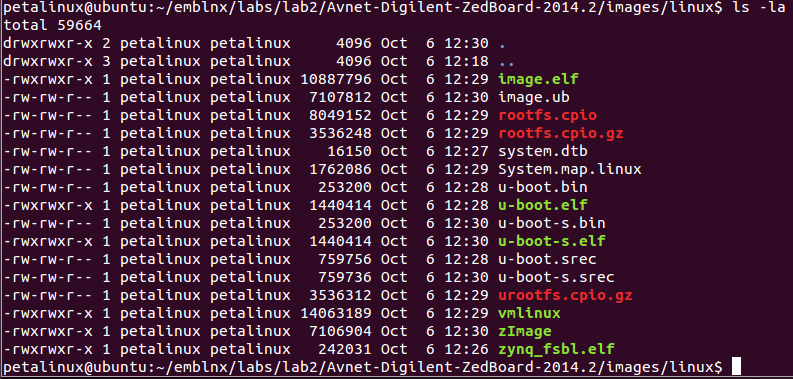
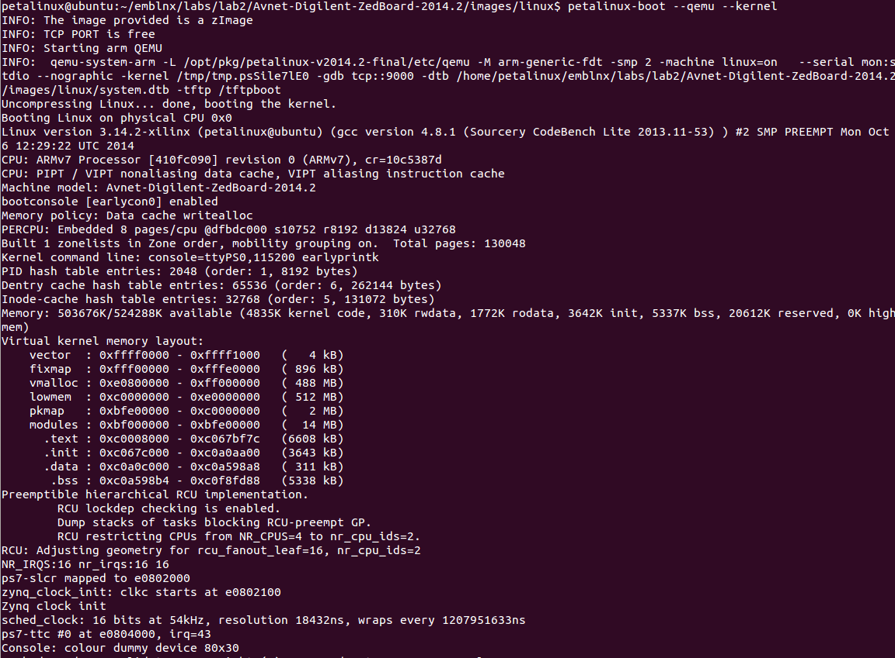
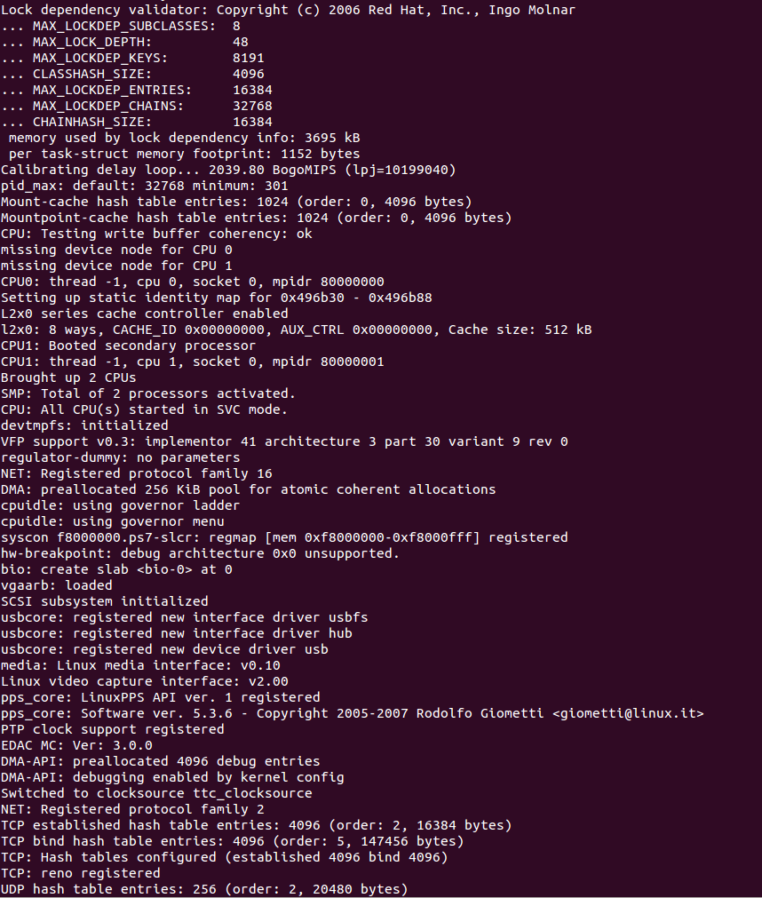
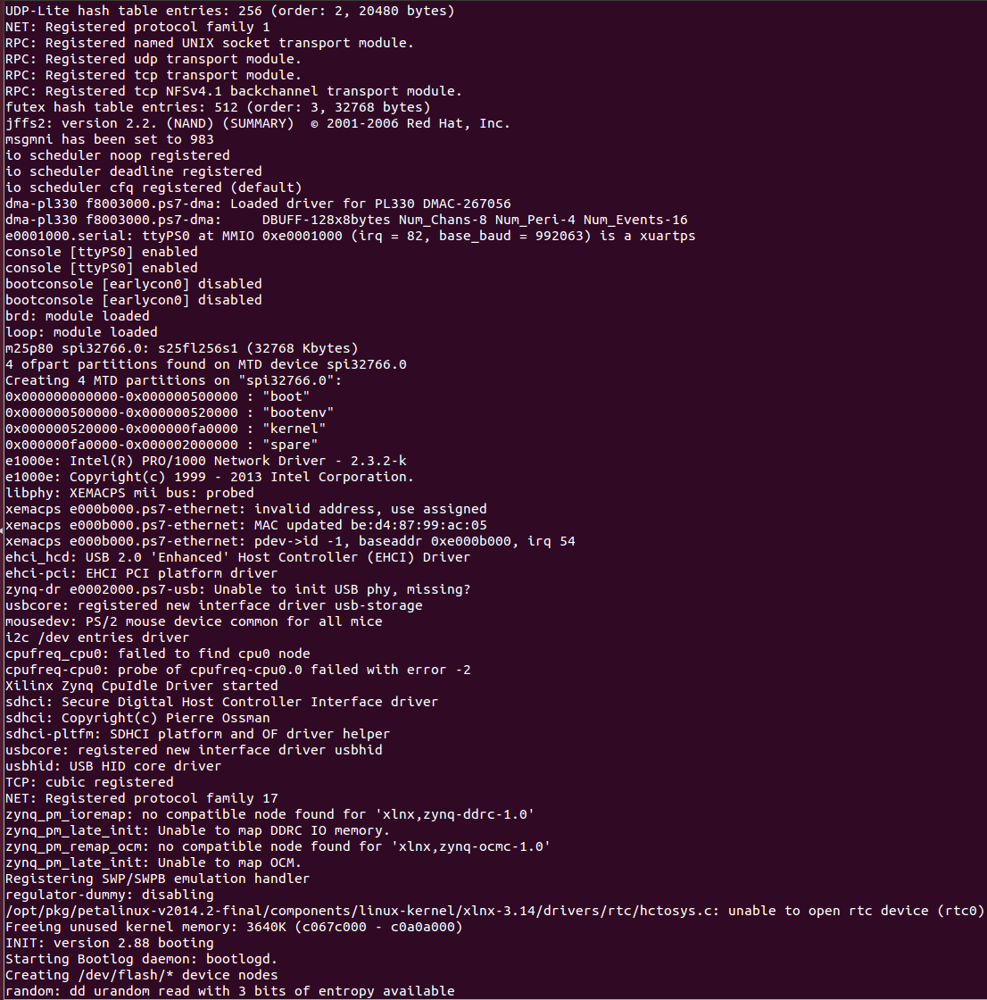
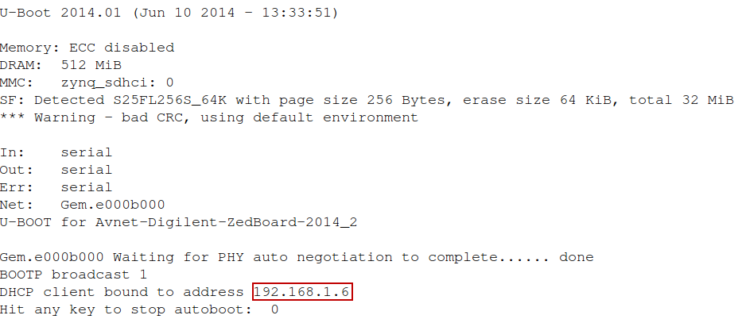

<!--
这里是注释。
本活动与上一活动放在同一个阶段了，每个 `work??.md` 文件对应一个活动。
-->

## Build and Boot an Image

### Introduction

The most basic skill required for developing embedded Linux is working
in the cross-compilation environment: compiling the kernel, libraries,
and applications and downloading the resulting image onto the embedded
target. The purpose of this lab is to familiarize you with this process.

This lab will prepare you for the most basic task of working with
embedded Linux: how to build and boot the operating system and
applications. Embedded Linux target processors, such as the ARM®
Cortex™-A9 MPcore, are usually developed in a cross-compilation
environment. This means that the kernel and applications are compiled on
a development machine (in this case, a Linux PC having a non-target
processor), and then downloaded onto the target.

The PetaLinux tools support a number of configuration architectures that
automate much of this process. In this lab, you will learn how to use
these tools and how to download the resulting embedded Linux image onto
the hardware platform.

QEMU is a generic and open-source machine emulator integrated into the
PetaLinux tools. In this lab, you will use QEMU to run the Linux built
for the ARM Cortex-A9 MPcore system. It can achieve near native
performance by executing the guest code directly on the host CPU

### Objectives

After completing this lab, you will be able to:

-   Build the ARM Cortex-A9 MPcore Linux kernel and applications

-   Boot the resulting system image in QEMU

-   Download the resulting system image onto the development board

### Preparation

If this is the first lab that you are performing, then refer to the
“Before You Start” section of Lab 1 for necessary preparatory
information on how to set up the environment.

If your workstation has been restarted or logout, run the following
command to start DHCP server on the host:

`[host] $ sudo service isc-dhcp-server restart`

Please refer to the “Initializing the Workshop Environment” section of
Lab 1 for detailed information.

### General Flow for this Lab

*   Step 1: Choosing a Linux Platform
*   Step 2: Building the Linux Image
*   Step 3: Booting the System

### Choosing a Linux Platform

A Linux platform tells what to build into the Linux image; it tells the
following information:

-   The hardware platform information such as address mapping,
    interrupts, and the processor’s characteristics, for example

-   The Linux kernel settings

-   User space applications settings

-   File system settings

-   Flash partition table settings

1.  Change the path to the project directory.

    1)  Run the following commands to create and change to the
        project directory path:

        `[host] $ mkdir ~/emblnx/labs/lab2`

        `[host] $ cd ~/emblnx/labs/lab2`

        Each lab in this workshop is installed in the `~/emblnx/labs` directory.
        Adjust the path if you have installed the labs at a different path.

2.  Use the `petalinux-create` command to create a new embedded Linux
    platform and choose the platform.

    1)  Source the PetaLinux tools if you didn't do it. It assumes that
        PetaLinux is installed in `/opt/Xilinx` directory

        ```
        [host] $ source /opt/Xilinx/petalinux-v2014.2-final/settings.sh
        ```

    2)  Run the following command from the `lab2` directory to create a new
        Petalinux project (Fig.\ [@fig:lab2petacreate]):

        ```
        [host] $ petalinux-create -t project -s \
        /opt/pkg/Avnet-Digilent-ZedBoard-v2014.2-final.bsp
        ```

        {#fig:lab2petacreate}

        The above command assumes that the board support package (BSP)
        is installed in the `/opt/pkg` directory. Modify the path if the
        BSP is in a different location.

        The command will create the PetaLinux software project directory:
        `Avnet-Digilent-ZedBoard-2014.2` under `~/emblnx/labs/lab2`.
        (Fig.\ [@fig:lab2petadir])

        A PetaLinux project directory contains configuration files of
        the project, the Linux subsystem, and the components of the
        subsystem.  `petalinux-build` builds the project with those
        configuration files. User can run `petalinux-config` to modify them.
        Below is the PetaLinux project directory.

        {#fig:lab2petadir}

    3)  Change the directory to \
        `~/emblnx/labs/lab2/Avnet-Digilent-ZedBoard-2014.2`.

### Building the Linux Image

1.  Now that you have selected a pre-built platform, build a Linux
    image based on this platform.

    1)  Enter the following command to build the Linux image: Note:
        if you find some errors like this, execute “petalinux-build”
        command 3 times. (Fig.\ [@fig:lab2bldimg1] and [@fig:lab2bldimg2])

        `$ petalinux-build`

        {#fig:lab2bldimg1}

        {#fig:lab2bldimg2}

        This may take a few minutes. During this time, the following
        will occur:

        -   Cross-compiling and linking of the Linux kernel (`linux-3.x/*`)

        -   Cross-compiling and linking of the default user libs and
            applications (`lib/*` and `user/*`)

        -   Building of a local copy of the ARM Cortex-A9 processor Linux root
            file system (`romfs/*`)

        -   Assembling of the kernel and root file system into a single
            downloadable binary image file (`images/*`)

        -   Copying of the image files from `images/` in to `/tftpboot`

        The build log is saved in the
        `~/emblnx/labs/lab2/Avnet-Digilent-ZedBoard-2014.2/build.log` file.

    2)  Once compilation completes, look at the contents in the `images/linux`
        subdirectory by executing the following commands from the project
        directory (Fig.\ [@fig:lab2genfiles]):

        `[host] $ cd images/linux`

        `[host] $ ls -la`

        {width="5.775in"
        height="2.7597222222222224in" #fig:lab2genfiles}

    3)  Examine the contents of the `/tftpboot` directory by executing:

        `[host] $ ls /tftpboot`

        All these files in the
        `~/emblnx/labs/lab2/Avnet-Digilent-ZedBoard-2014.2/images/linux`
        directory have a copy in `/tftpboot` because as part of the build
        process, the image files have also been copied there. The development
        machine has been configured as a TFTP (trivial FTP) server, allowing the
        board to pull new kernel images directly over the network from the fixed
        known location (instead of knowing the actual paths of the project
        directories). You will use this capability in the next exercise.

          **Image Name**                       **Descriptions**
          ------------------------------------ -------------------------------
          `image.elf`                          Linux image in ELF format
          `image.srec`                         Linux image in SREC format
          `image.ub`                           Linux image in U-Boot format
          `rootfs.cpio`                        Root file system image
          `u-boot.bin`                         U-Boot image in binary format
          `u-boot.srec`                        U-Boot image in SREC format
          `u-boot.elf`                         U-Boot image in ELF format
          `u-boot-s.*`                         Relocatable U-Boot image
          --------------------------------------------------------------------

### Booting the System

1.  As mentioned earlier, you can run Linux for the ARM Cortex-A9
    MPcore system on QEMU.

    Load the ARM Cortex-A9 MPcore Linux on QEMU.

    1)  Enter the following command in the host Terminal window to load the
        kernel only (Fig.\ [@fig:lab2consoleout1]~[@fig:lab2consoleout3]):

        `[host]$ petalinux-boot --qemu --kernel`

        {#fig:lab2consoleout1}

        

        

        {#fig:lab2consoleout3}

    2)  Log into the system and explore it as you did in the "A First
        Look" lab.

        **Note:** Use `root` as the login name and password.

    3)  Exit QEMU by pressing `<Ctrl+a>` then `<x>`.

2.  Copy the `BOOT.BIN` file from the pre-built directory to the SD card.

    1)  Copy only the `BOOT.BIN` file from the
        `~/emblnx/labs/lab2/Avnet-Digilent-ZedBoard-2014.2/pre-built/linux/images`
        directory to the SD card.

    2)  Make sure that the board is turned OFF.

    3)  Insert the SD card into the target board.

    4)  Make sure that the board is set to boot from the SD card.

3.  Run the DHCP server on the host.

    1)  Run the DHCP server:

        `[host]$ sudo service isc-dhcp-server restart`

4.  Power up the board and set the serial port terminal.

    1)  Power ON the board.

    2)  Run the following command to make sure that `/dev/ttyACM0` is set
        to read/write access:

        `[host]$ sudo chmod 666 /dev/ttyACM0`

    3)  In the dashboard, in the Search field, enter the serial port.

    4)  Select the **Serial port terminal** application.

5.  Boot the new Linux image on the board.

    1)  Reset the board (BTN7) to see the booting info on the GtkTerm
        console as the board goes through the boot process.

    2)  Press any key to stop auto-boot when you see messages similar to
        the following in the GtkTerm window (Fig.\ [@fig:lab2stopautoboot]):

        {#fig:lab2stopautoboot}

    3)  If you did not see the “DHCP client bound to address” message during
        uboot bootup, you will need to run dhcp to obtain the IP address. (Fig.\ [@fig:lab2ubootdhcp])

        `U-Boot-PetaLinux> dhcp`

        {#fig:lab2ubootdhcp}

    4)  Set the TFTP server IP to the host IP by running the following
        command in the u-boot console:

        `U-Boot-PetaLinux> set serverip 192.168.1.1`

    5)  Download and boot the new image using TFTP by executing this command
        in the u-boot console:

        `U-Boot-PetaLinux> run netboot`

        This command will download the image.ub file from /tftpboot on the host
        to the main memory of the ARM Cortex-A9 MPcore system and boot the
        system with the image.

    6)  Watch the GtkTerm window.

        Messages similar to the following show the image download progress. (Fig.\ [@fig:lab2dldkernel])

        {#fig:lab2dldkernel}

        The `netboot` command will automatically boot the system as soon as the
        image is finished downloading.

    7)  Watch the booting messages on the GtkTerm window.

        Other booting messages are the same as from the Lab1 because you used
        the default configuration.

6.  Use `ping` command to test the network connection.

    1)  After the system boots, log into the system by entering `root` as
        both the login name and password.

    2)  Execute the `ping` command to ping the host machine.

        `# ping 192.168.1.1`

        You should see the response from the host machine.

    3)  Execute the `ping` command from the host machine terminal window to
        see the response from the target board.

        `[host]$ ping 192.168.1.6`

        Use different ip address if the board is bound to different
        address (see Figure [@fig:lab2stopautoboot] to find out the
        address). You should see the response from the host machine.

7.  Soft reboot from Linux.

    1)  Run the `reboot` command in the serial terminal window tools to
        reboot the system:

        `# reboot`

        The system should reboot.

    2)  Close the GtkTerm window.

    3)  Power off the board.

### Conclusion

In this lab, you have learned how to:

-   Cross-compile Linux

-   Boot Linux for an ARM Cortex-A9 MPcore system in QEMU

-   Download a new image to the board via Ethernet

You will use these capabilities in subsequent labs.

### Completed Solution

If you want to run the solution then copy `BOOT.bin` from the \
`labsolution/lab2/SDCard` directory onto a SD card. Place the SD card
in the ZedBoard. Set ZedBoard in the SD Card boot mode. Connect the
ZedBoard to the host machine using Ethernet cable.

Run the following command to start DHCP server on the host:

`[host] $ sudo service isc-dhcp-server restart`

Copy the `image.ub` file from the `labsolution\lab2\tftpboot`
directory into `/tftpboot` directory.

Power ON the board. Set the terminal session. Interrupt the boot process
when autoboot message is shown. Set the serverip address using the
following command in the target board terminal window:

`#set serverip 192.168.1.1`

Run the netboot command:

`#run netboot`

Login into the system and test the lab.
