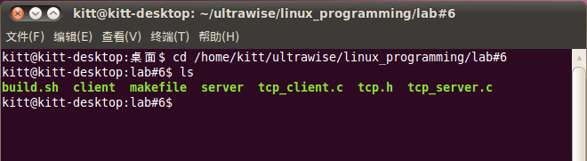
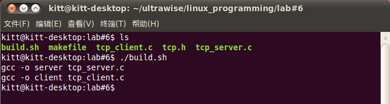
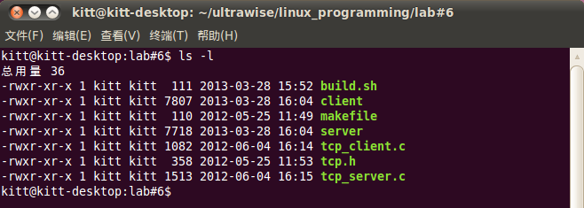
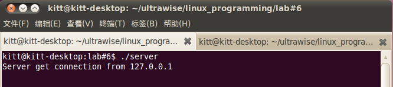
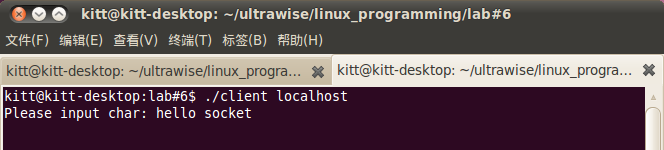
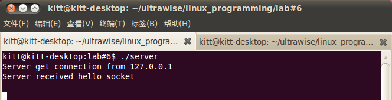

<!--
这里是注释。
本活动与上一活动放在同一个阶段了，每个 `work??.md` 文件对应一个活动。
-->

## Linux网络编程实验

### 实验目的

-   深入理解TCP/IP协议模型

-   熟悉并学会Linux的Socket套接字编程方法

-   熟悉使用TCP协议编程的基本过程

-   熟练掌握基于客户/服务器模式应用程序的编写方法

### 实验原理

-   本程序通过建立基于TCP协议的服务器与客户端的通讯，使客户端向服务器发
    送字符串，服务器将接收到的字符串打印出来。

-   服务器代码流程图如图\ [@fig:lab6flowserver] 所示。

    {#fig:lab6flowserver}

-   客户端代码流程图如图\ [@fig:lab6flowclient] 所示

    {#fig:lab6flowclient}

### 步骤与现象

-   打开终端并进入实验代码目录，即输入以下命令：

    `cd /home/zynq/linux_programming/lab#6`

    如下图所示，进入目录后可以看见实验参考代码`tcp_client.c`、`tcp.h`和
    `tcp_server.c`。\
    

-   编译应用程序

    在终端中输入命令：`./build.sh`\
    

    用gcc命令编译`tcp_client.c`和`tcp_server.c`成可执行文件`client`与`server`\
    

-   运行应用程序

    打开两个终端，先在一个终端中运行服务器程序`server`，然后在另一个终端
    中运行客户端程序`client`\
    \
    

    从运行情况可以看出，在没有客户连接上来时服务器程序阻塞在`accept`函数
    上，等待连接。当有客户程序连接上来时，阻塞在`read`函数上，等待读取消息。
    当客户发送消息接收后结束，服务器读取消息并打印出来，继续等待新的连接。\
    

### 关键代码分析

-   服务器代码分析

```c
int main(int argc,char**argv)
{
	int sockfd,client_fd;
	int addr_len = sizeof(struct sockaddr_in);
	struct sockaddr_in server_addr;
	struct sockaddr_in client_addr;
	char buf[BUF_SIZE];
	int bytes;
	//服务器端开始建立socket描述符
	if((sockfd=socket(AF_INET,SOCK_STREAM,0))==-1)  {
		fprintf(stderr,"socket error:%s\n",strerror(errno));
		exit(1);
	}
	//服务器端填充sockaddr结构体
	bzero(&server_addr,addr_len);//初始化，置0
	server_addr.sin_family = AF_INET;//IPV4网络协议
	server_addr.sin_port = htons(SERVER_PORT);//设置端口号
	//设置服务器运行在和IP的主机上
	server_addr.sin_addr.s_addr = htonl(INADDR_ANY);
	//绑定socket描述符到IP地址
	if(bind(sockfd,(struct sockaddr*)&server_addr,addr_len)==-1)  {
		fprintf(stderr,"bind error:%s\n",strerror(errno));
		exit(1);
	}
	//设置运行连接的最大客户端数
	if(listen(sockfd,5)==-1){
		fprintf(stderr,"listen error:%s\n",strerror(errno));
		exit(1);
	}

	while(1)
　　　{
		//服务器阻塞，直到客户程序建立连接
		if((client_fd = accept(sockfd, (struct sockaddr*)&client_addr,
		    &addr_len))==-1) {
			fprintf(stderr,"accept error:%s\n",strerror(errno));
			exit(1);
		}
		//将网络地址转化成字符串并打印出来
		fprintf(stderr, "Server get connection from %s\n",
			inet_ntoa(client_addr.sin_addr));
		if((bytes = read(client_fd,buf,BUF_SIZE))==-1) {
			fprintf(stderr,"read error:%s\n",strerror(errno));
			exit(1);
		}
		//在接收字符的最后加上终止符
		buf[bytes]='\0';
		printf("Server received %s\n",buf);
		//关闭这个通讯连接
		close(client_fd);
	}
	close(sockfd);
	return 0;
}
```

-   客户端代码分析

```c
int main(int argc,char**argv)
       {
	int sockfd;
	int addr_len = sizeof(struct sockaddr_in);
	struct sockaddr_in client;
	struct hostent *host;
	char buf[BUF_SIZE];
	int bytes;
	if(argc!=2)  {
		fprintf(stderr,"Usage:%s hostname \a\n",argv[0]);
		exit(1);
	}
	//使用hostname查询主机的名字
	if((host=gethostbyname(argv[1]))==NULL)  {
		fprintf(stderr,"Gethostname error\n");
		exit(1);
	}
	//客户程序开始建立socket描述符
	if((sockfd=socket(AF_INET,SOCK_STREAM,0))==-1)  {
		fprintf(stderr,"socket error:%s\n",strerror(errno));
		exit(1);
	}
	//客户端程序填充服务器的资料
	bzero(&client,addr_len);//初始化，置0
	client.sin_family=AF_INET;//IPV4网络协议
	client.sin_port=htons(SERVER_PORT);//设置端口号
	client.sin_addr=*((struct in_addr *)host->h_addr);//设置IP地址
	//客户程序发起连接请求
	if(connect(sockfd,(struct sockaddr*)&client,addr_len)==-1)  {
		fprintf(stderr,"connect error:%s\n",strerror(errno));
		exit(1);
	}
	//连接成功
	printf("Please input char: ");
	//发送数据
	fgets(buf,BUF_SIZE,stdin);
	write(sockfd,buf,strlen(buf));
	//结束通讯
	close(sockfd);
	return 0;
}
```
