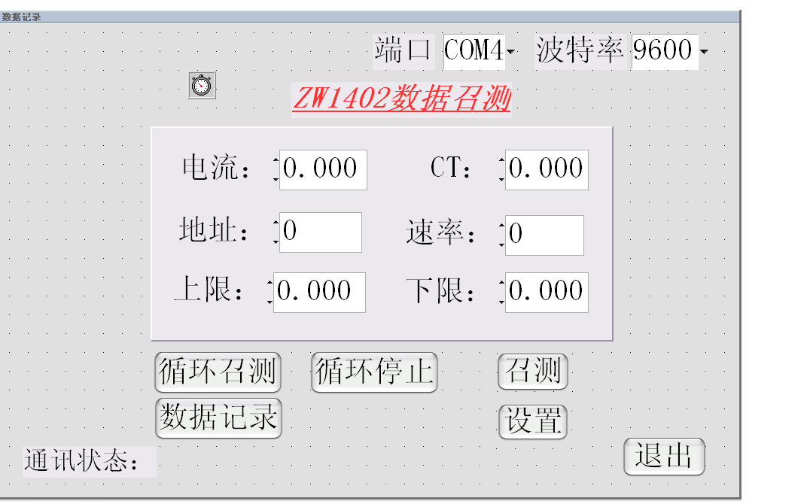
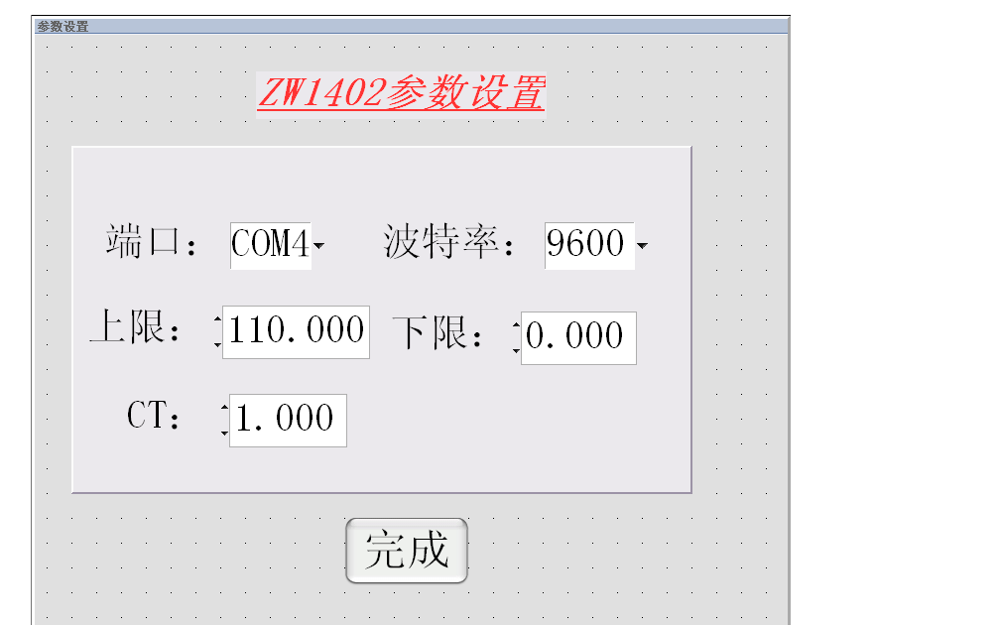
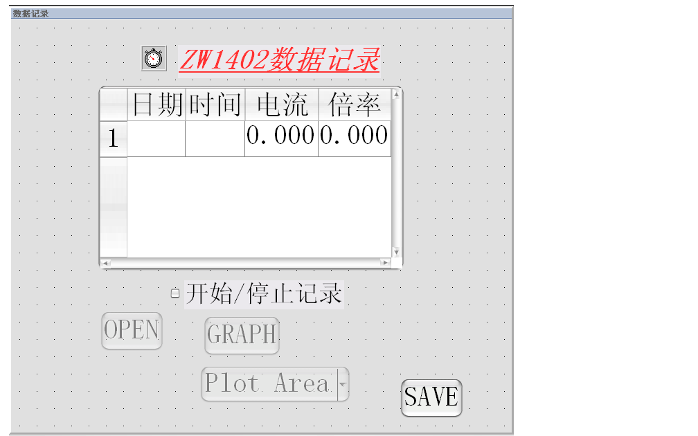

# 系统功能实现

## 系统模块

整个测量控制系统的模块如图 [@fig:ch3systemmodule] 所示。

{#fig:ch3systemmodule}

## 图形界面框图设计

传统仪器面板上的器件都是实物，而且是用手动和触摸进行操作的，而虚拟仪器的
面板控件是外形与实物相像的图标，“通”、“断”、“放大”等对应着相应的软件程序。
这些软件已经设计好了，用户不必设计，只需选用代表该软件程序的图形控件即
可，有计算机的鼠标对其进行操作。因此，设计虚拟面板的过程就是在面板设计窗
口中摆放所需的控件，然后编写相应的程序。面板和控件是虚拟仪器的重要组成部
分。一个虚拟仪器可包含多个仪器面板，每个面板中可以包含不同的控件，而面板
本身也是一个控件。

### 主面板

主面板--数据召测面板设计的系统框图如图 [@fig:ch3mainpanel] 所示。

{#fig:ch3mainpanel}

首先建立一个名为 comm.uir 的用户界面，在此基础上建一个名为“数据召测”的主
面板。在面板上，两个循环控件作为串口号和波特率的输入，让用户在设定的一组
数值中选择，以防用户输入不规范的数值；六个数字控件用来显示从仪表读到的数
据，分别是电流、电流倍率 (CT)、仪表地址、电流值的上下限，除了地址和速率
这两个控件的数据类型设定为整形外，其余的都设定为包含3个小数点的浮点型；
六个命令按钮控件，分别用来控制数据召测、循环召测、停止循环召测、数据记录、
参数设置和退出，其中数据记录和参数设置这两个控件都会打开相应的子面板；
一个时钟控件用来控制数据的循环召测，时间间隔设定为 0.333 秒，与仪表刷新
率一致；两个信息框控件，一个用来显示面板的功能，一个用来根据通讯的进行显
示通讯状态。

### 子面板一

子面板—参数设置面板设计的系统框图如图 [@fig:ch3subpanel1] 所示。

{#fig:ch3subpanel1}

在 comm.uir 的用户界面上，又创建一个名为“参数设置”的子面板。在面板上，两
个循环控件作为串口号和波特率的输入，让用户在设定的一组数值中选择，以防用
户输入不规范的数值；三个数字控件用来显示要对仪表设置的参数的数值，分别是
电流倍率 (CT)、电流值的上下限，都设定为包含3个小数点的浮点型；一个命令按
钮控件，用来控制设置界面的退出；一个信息框控件，用来显示面板的功能。

### 子面板二

子面板--数据记录面板设计的系统框图如图 [@fig:ch3subpanel2] 所示。

{#fig:ch3subpanel2}

在名为 comm.uir 的用户界面上，再创建一个名为“数据记录”的子面板。在面板上，
一个表格控件用来逐一地显示数据，该表格一共有4列，标题分别为日期、时间、
电流和倍率；一个触发按钮控件作为控制开始或停止数据记录的时钟控件的触发；
一个循环控件，用来让用户选择图表的类型，共设定有 12 种图表类型；一个时钟
控件用来控制数据记录的开始或停止，时间间隔设定为 1 秒，方便记录；三个命
令按钮控件，分别用来控制画图界面的打开、开始画图和退出；一个信息框控件，
用来显示面板的功能。

### 基本控件用途及输入或显示控件属性

基本的控件用途如表 [@tbl:ch3controlfunction] 所示，主要控件的属性设置如
表 [@tbl:ch3controlproperty] 所示。

Table: 基本的控件用途 {#tbl:ch3controlfunction}

------------------------------------------------------------------------------
控件名       回调函数       用途         控件名     回调函数      用途
------------ -------------- ------------ ---------- ------------- ------------
MEASURE      Measure        单次召测     OVER       Over          对仪表进行\
                                                                  参数设置

CYCLE        Cycle          循环召测     RING       ChartSelect   选择图表的\
                                                                  类型

STOP         Stop           停止循环     SWITCH     Switch        触发时钟控\
                                                                  件运行

TIMER        Time           控制循环     RECORD     Record        记录数据

REC          Rec            打开数据\    OPEN       Open          打开画图界面
                            记录面板

ESTAB        Estab          打开参数\    GRAPH      Graph         画图
                            设置面板

QUITBUTTON   QuitCallback   退出主面板   SAVEFILE   SaveFile      保存数据并\
                                                                  退出面板
------------------------------------------------------------------------------

Table: 输入或显示控件的属性设置 {#tbl:ch3controlproperty}

----------------------------------------------------------------------
ConstName   Lable    控件类型   用途
----------- -------- ---------- --------------------------------------
COMM\       端口     Ring       在主面板，供用户选择设定好的串口号\
COMPORT                         在设置参数时供用户选择串口号

BAUD\       波特率   Ring       在主面板，供用户选择设定好的波特率\
BAUDRATE                        在设置参数时供用户选择波特率

DATA        电流     Numeric    显示从仪器读到的电流数值

ADDR        地址     Numeric    显示从仪器读到的通讯地址

IRR\        CT       Numeric    显示从仪器读到的电流倍率\
IR                              在设置参数时供用户设置电流倍率

UPR\        上限     Numeric    显示从仪器读到的电流上限\
UP                              在设置参数时供用户设置电流上限

LOWR\       下限     Numeric    显示从仪器读到的电流下限\
LOW                             在设置参数时供用户设置电流下限

TABLE       --       Table      显示逐一记录的数据
----------------------------------------------------------------------

## 用户图形界面

主界面--数据召测面板如图 [@fig:ch3uimain] 所示，主要显示可供用户使用的界
面，通过主面板，用户可以使用该虚拟仪器。子面板--参数设置面板如图
[@fig:ch3uiset] 所示，主要用来显示对仪表参数的设置内容，这个子面板是由主
面板的“设置”控件触发打开的。子面板--数据记录面板如图 [@fig:ch3uidatalog]
所示，主要用来显示并记录从仪表循环读取的电流读数，这个子面板是由主面板的
“数据记录”控件触发打开的。

{#fig:ch3uimain}

{#fig:ch3uiset}

{#fig:ch3uidatalog}

## 控件具体功能实现

### 变量的定义

在数据召测主面板中定义的变量如表 [@tbl:ch3measurevar] 所示，在参数设置子
面板定义的变量如表 [@tbl:ch3setvar] 所示。

在主面板中除了 comm 和 baud 是用户输入的，其他都是通过串口从仪表读进来的，
而参数设置面板中的变量都是供用户输入来设置仪表参数的。函数
`SetCtrlVal()` 是用来显示面板上数字控件的数值，可以将从串口读取的数据显
示在数字控件上；而函数 `GetCtrlVal()` 则是用来获得面板上数字控件的数值，
可以读取该控件上的数值，并存到指定的变量中，以供程序使用。

Table: 数据召测主面板的变量定义 {#tbl:ch3measurevar}

变量   数据类型   初值    变量   数据类型   初值
------ ---------- ------- ------ ---------- -------
data   float      0.000   upr    float      0.000
irr    float      0.000   lowr   float      0.000
addr   int        0       comm   int        4
rate   int        0       baud   int        9600

Table: 参数设置子面板的变量定义 {#tbl:ch3setvar}

变量       数据类型   初值    变量   数据类型   初值
---------- ---------- ------- ------ ---------- ---------
comport    int        4       up     float      110.000
baudrate   int        9600    low    float      0.000
ir         float      1.000

### 数据召测主面板部分

#### 单次召测

单次召测的具体实现过程如图 [@fig:ch3measuresingle] 所示。

{#fig:ch3measuresingle}

首先用函数 `OpenComConfig()` 打开串口，对串口的端口号、波特率、奇偶校验
位、数据位、输入及输出队列长度等进行相应的设置。然后根据仪表上位机的帧格
式，读取仪表的电流，即将输出队列通过函数 `ComWrt()` 写到串口，给仪表发送
上位机帧格式，再利用函数 `ComRd()` 从串口读取数据，判断读取的帧格式是否
正确，如果正确就在相应的控件显示，否则在“通讯状态”处显示“通讯超时”提示用
户出现通讯错误。接着继续读仪表的其他参数值，如倍率、地址、速率及电流上下
限。判断每一个数据的帧格式是否正确，如果正确就依次显示，否则按照相应的参
数显示其通讯超时信息。

#### 循环召测

循环召测的具体实现过程如图 [@fig:ch3measureloop] 所示。

{#fig:ch3measureloop}

首先改变时钟的属性 `ATTR_ENABLED`，驱动时间控件，使得在每一个时钟周期到
来时读电流，并显示在相应的数字控件上，同时通过函数 `RdData()` 将仪表的其
他参数都进来并显示在相应的控件上。判断时钟控件是否还在运行，如果是就继续
循环召测电流，否则就停止召测。

### 参数设置子面板部分

参数设置的具体实现过程如图 [@fig:ch3setflowchart] 所示。

{#fig:ch3setflowchart}

首先点主面板的“设置”按钮，弹出参数设置面板，用户可对面板上的参数进行设置，
然后单击“完成”按钮，即可退出子面板，并在主面板显示通讯正确与否，如果正
确就显示“成功”，否则就显示“通讯错误”。

### 数据记录子面板部分

#### 数据记录

数据记录的具体实现过程如图 [@fig:ch3datalogflow] 所示。

{#fig:ch3datalogflow}

首先点主面板的“数据记录”按钮，弹出数据记录面板。再打开的子面板中点击“开
始/停止记录”的开关控件，触发时钟控件开始运行，在表格里逐一记录数据。若要
停止记录，可以在此点击开关控件，即停止记录数据。

#### 画图

画图的具体实现过程如图 [@fig:ch3plotflow] 所示。

{#fig:ch3plotflow}

点击 OPEN 按钮，打开 Excel 画图界面，将表格上的数据复制到 Excel 上。再点
击 GRAPH 按钮，在 Excel 画图。如果要选择其他形状的图形，可以在面板上的选
择控件选择，可以在 Excel 里画出相应的图形。

#### 保存数据

保存数据的具体实现过程如图 [@fig:ch3datasave] 所示。

{#fig:ch3datasave}

点击 SAVE 按钮，弹出保存对话框，在对话框内选择保存路径，输入文件名，然后
保存，就开始将表格上的数据一条一条保存，直至保存到最后一条。
