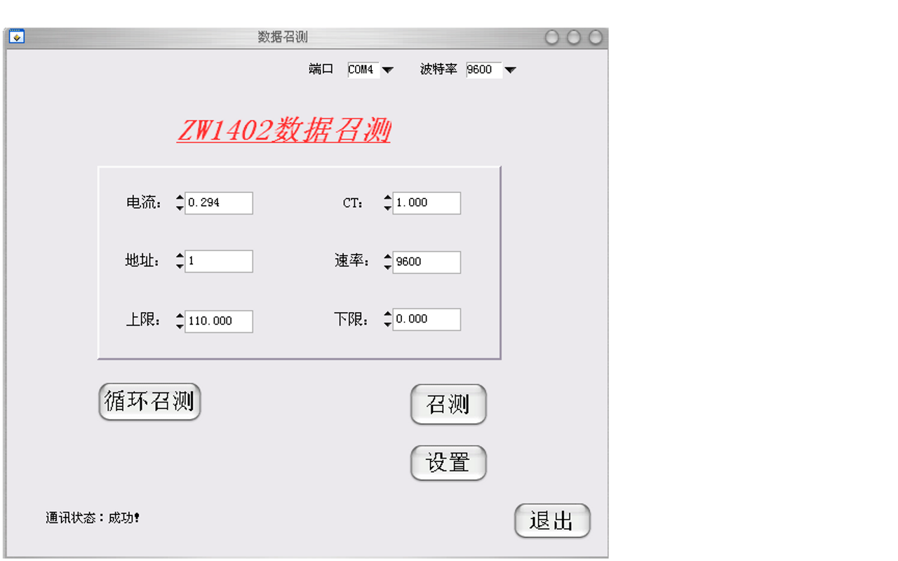
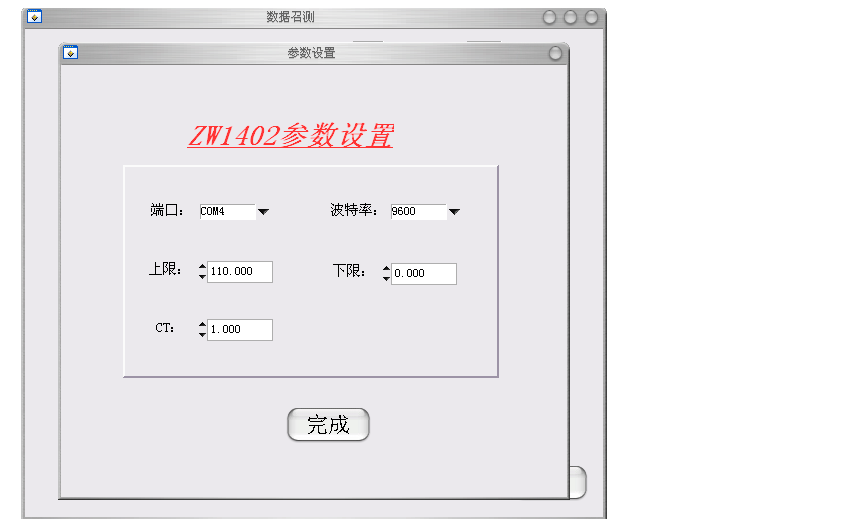
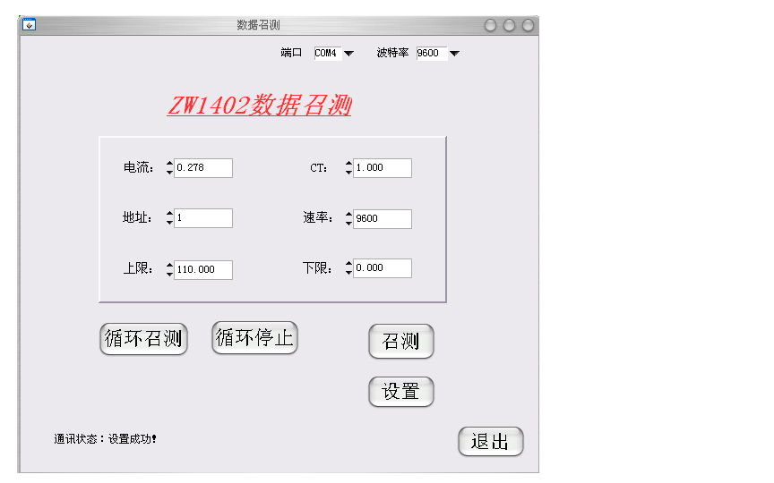
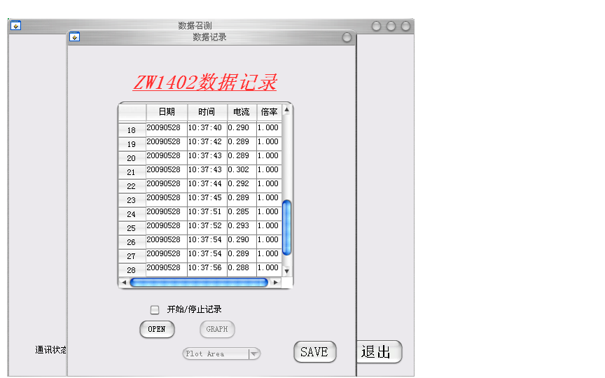
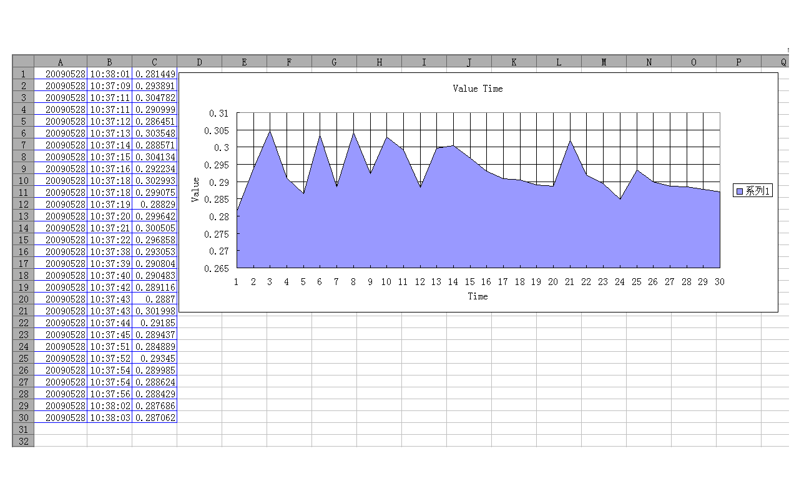
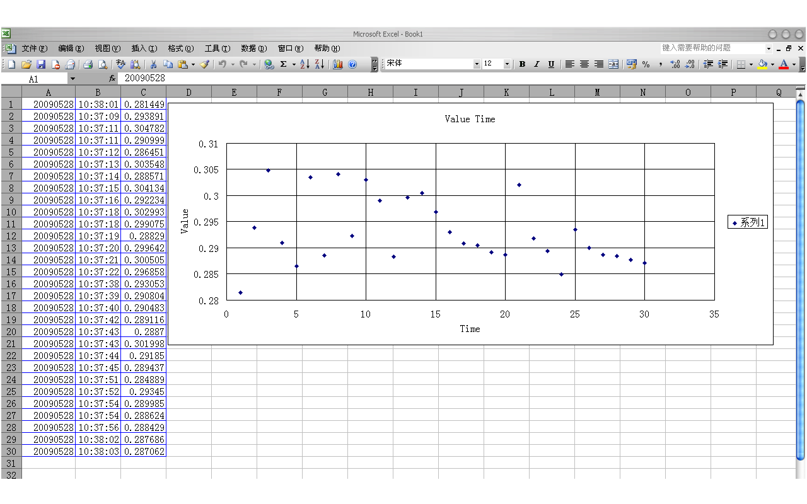
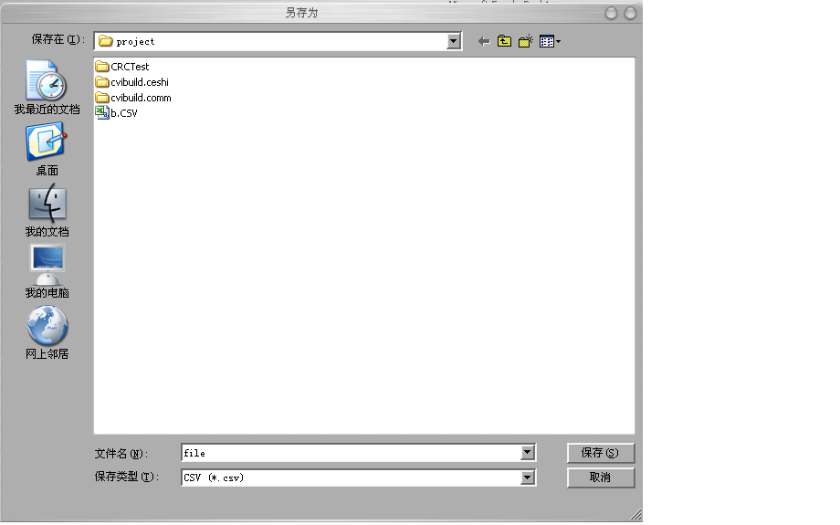
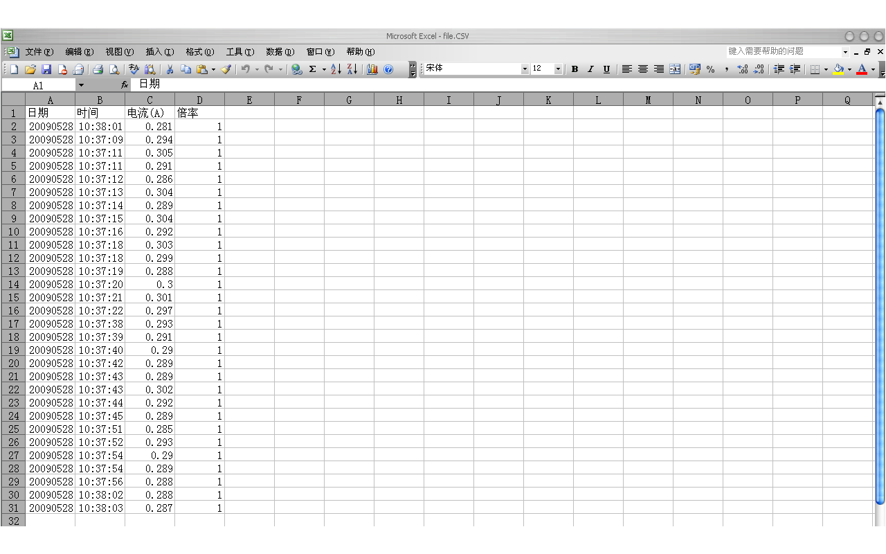

# 系统结果分析

## 运行分析

将仪表接上笔记本电脑的电源，程序运行后，在主面板上选择串口 COM4，波特率
9600，点击“召测”，可以看到面板上显示从仪表读到的电流和其他参数值，并且在
“通讯状态”处显示“成功”，其图形界面如图 [@fig:ch4singlemeasure] 所示。

{#fig:ch4singlemeasure}

点击“设置”，则弹出一个参数设置面板，如图 [@fig:ch4setscreen] 所示。在该
面板设置仪表的各种参数，再点击“完成”，子面板消失，则返回主面板，并在“通
讯状态”处显示“设置成功”，如图 [@fig:ch4setsuccess] 所示。

{#fig:ch4setscreen}

{#fig:ch4setsuccess}

点击“循环召测”，电流一栏的数据会自动地不停变化，原先隐藏的“停止循环”和“
数据记录”的按钮出现。点击“数据记录”，则弹出数据记录面板，点击选中“开始/
停止记录”，则开始记录数据。再次点击开关控件，则停止记录，“OPEN”按钮由初
始的模糊变清晰，成为可用按钮，此时界面如图 [@fig:ch4datalogscreen] 所示。
点击“OPEN”按钮则弹出 Excel 界面，并且将表格上的数据复制到 Excel 中，如
图 [@fig:ch4datasavescreen] 所示。在数据记录面板张点击“GRAPH”，则在
Excel 界面画出相应的图形，如图 [@fig:ch4plotscreen] 所示。在供选择图表类
型的控件选择不同的选项，则可相应画出不同类型的图形，例如 XY 轴分散图，如
图 [@fig:ch4plotscatter] 所示。

{#fig:ch4datalogscreen}

{#fig:ch4datasavescreen}

{#fig:ch4plotscreen}

{#fig:ch4plotscatter}

将画图界面关掉，点击“SAVE”按钮，则弹出保存对话框，选择保存路径，输入文件
名，即可保存。保存对话框如图 [@fig:ch4savedialog] 所示，保存结果如图
[@fig:ch4saveresult] 所示。保存后，数据记录面板被关闭，重新返回主面板。
点击“停止循环”，则电流数值停在当前数值，不再变化。点击“退出”即可关闭主面
板。

{#fig:ch4savedialog}

{#fig:ch4saveresult}

## 结果分析

本次设计的目的是实现自动化测量和数据处理，由程序运行过程来看，该系统可以
实现单次测量即手动测量，也可以实现循环测量即自动化测量，还可以对仪表的参
数进行设置。在循环测量的基础上，可以实现数据记录，并且可以逐条更新显示。
对表格记录的数据可以进行不同类型图形的画图分析，最后还可以保存数据。综上，
本次设计基本完成预计任务。但由于时间和精力有限，也存在一些不足，例如数
据记录的时间间隔不能自由设定；画图时只能取少于或等于 30 个数据，不能随着
记录的数据个数灵活变化；系统的功能相对简单，没有实现更深入的功能扩展和数
据分析。
