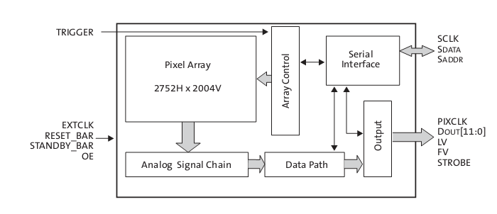
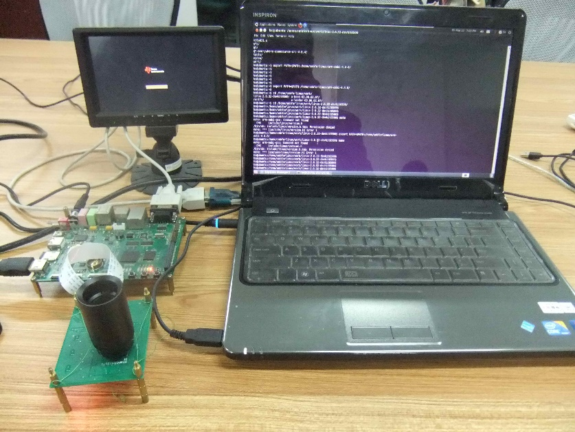

# 高清视频采集与处理系统分析与设计

## 系统总体方案分析与设计

### 系统需求分析

高清视频采集与处理系统在不同的应用环境下有不同的应用需求，本文主要针对安
防监控、医疗卫生等领域设计的应用系统。高清采集与处理系统一般由高清视频采
集模块、高速传输、高速处理器、存储单元、高清显示接口等几个部分组成
[@liyudong2010]。结合本系统的实际情况，以及系统稳定性及可扩展性等方面要
求，系统设计时需要结合以下几个设计原则 [@hejingbo2009]：

1.  技术先进性：结合国内外高清视频采集与处理技术的发展趋势和当前微处理器
    技术水平，采用先进且比较成熟的硬件和软件技术。

2.  可靠性：系统应该能够长时间正常稳定工作，并具有一定的纠错能力，在系统
    出现故障，可以使系统整体工作不受影响或具有自启动功能。

3.  可扩展性：设计的系统应该有良好的扩展性能，为将来的系统扩展预留相应的
    接口和存储空间。

4.  标准化、模块化：程序设计过程中应该保证编程的标准化，接口的标准化，程
    序设计应该按模块划分，依照低耦合高内聚的原则，各个模块技术相对独立又
    是有机统一整体。

5.  高性价比：在能够满足系统设计需求的前提下，应确保系统最优性价比。

6.  易操作性：为方便用户使用，系统应设计非常友好的人机交互界面，易操作的
    图标按钮等。

本文设计的高清视频采集与处理系统结合实际应用需求和以上的设计原则，制定了
系统的设计目标如下：

1.  系统前端采集模块至少能够采集200万像素的高清视频信号。

2.  系统应该带有USB、TF接口、串口、SPI接口、IIC接口、JTAG接口、CAMERA接
    口、TFT屏接口、触摸屏接口、网络接口、HDMI接口。

3.  能够实现对视频进行图像增强，边缘检测，人脸跟踪等算法处理。

4.  高清视频输出分辨率和帧率至少为 720p/30f。

5.  具有人机交互界面。

### 系统总体方案设计

嵌入式高清视频采集与处理系统包含硬件和软件两个部分，需要用到软硬件等多方
面知识。如果要想有一个好的设计基础，就必须有一个好的设计方案。系统硬件部
分主要由前端采集模块、微处理器模块、存储模块、显示模块以及各种通信接口，
如SPI、IIC、TFT、ISP、HDMI等组成。为了在开发阶段调试方便，需要设计调试接
口，如UART、JTAG等。系统软件部分由嵌入式操作系统，设备驱动程序，应用程序
等组成。操作系统又包括引导程序 BootLoader、内核、根文件系统等，驱动程序
主要为图像采集传感器驱动程序，应用程序包括视频采集程序、视频处理程序、界
面设计程序等。该系统的总体设计框架如图 [@fig:ch2sysoverview] 所示。

{#fig:ch2sysoverview}

## 系统硬件方案设计

### 系统硬件总体框架设计

为了便于以后程序的开发以及节省成本，首先要选择一个好的硬件平台，好的平台
是系统成功的基础。而硬件平台的核心就是微处理器，目前市场上微处理器大约有
1000多种 [@furber2005]，如何从中找出合适的微处理器也比较困难。本文在上述
的设计原则及设计目标基础上，综合考虑其他因素，设计了如下的硬件整体设计框
图，见图 [@fig:ch2hwblock]（具体芯片的选型参见下节）。

{#fig:ch2hwblock}

图中我们可以看到，硬件设备由微处理器和外围设备组成，微处理器采用的TI公司
的OMAP系列的TMS320DM3730处理器，该处理器为双核结构ARM+DSP，其中ARM核为
Cortex-A8架构，主频为 \SI{1}{\giga\hertz}，DSP核为C64x架构，主频为
\SI{800}{\mega\hertz}。图像采集传感器采用的APTINA公司的MT9P031芯片，该芯
片为CMOS系列图像传感器，最大可以采集 \SI{5}{\mega p} 像素的数字图像信号。
系统电源由TI公司的TPS65930电源芯片供应，提供 \SI{1.2}{\volt}、
\SI{1.8}{\volt}、\SI{3.3}{\volt} 等电压。系统的网络模块由DM9000网络芯片
提供，外部存储单元采用Micron公司的高速DDR RAM和NAND FLASH实现高速数据传
输与存储，同时系统还提供MMC接口和USB2.0接口，MMC接口可以用来存储数据以及
系统更新使用，USB2.0接口可以接鼠标操作系统界面。

根据该硬件框图，系统总体的工作流程为，系统首先通过CMOS镜头采集高清高速视
频数据，通过ISP接口输出到DM3730的ARM核处理单元，由芯片的硬件单元对采集的
视频进行去噪，白平衡，黑色补偿等前端与后端硬件处理。如果在人机界面选择需
要视频图像处理，如图像增强，人脸跟踪等，则系统将前期处理后的数据送到DSP
核，再由该DSP核对视频数据做算法处理，并将处理的结果送到ARM核，由该处理单
元将处理后的数据通过HDMI接口输出显示或者压缩后通过网络输出。

### 芯片的选型与介绍

#### 微处理器选型与介绍 

嵌入式系统开发的首要步骤就是选择一款合适的嵌入式处理器，相当于系统的大脑。
如今嵌入式微处理器芯片主要有ARM、DSP、ASIC、FPGA等几种，且不同的处理器
有不同的用途 [@pengqz2005]。ARM作为通用嵌入式处理器，由于其能够运行良好
的实时操作系统包括Windows CE和Linux系统，其主频速度越来越高，开发相对容
易，比较适合较为复杂的控制系统，现在正被广大用户热捧，但是对于处理高清视
频数据，由于数据量巨大，而其没有专门的硬件算法功能，运行起来会比较吃力。
DSP芯片运算能力很强大和可编程的灵活性很高，且功耗比较低，很合适处理高清
视频这种大数据量的运算，但是它的操作系统比较简单，当使用复杂的功能时比如
本文设计高清视频采集与处理系统，在实现人机交互功能上就比较困难。FPGA具有
强大的并行处理能力以及可定制流水线的结构，也比较适合本系统的设计需求，但
是其成本高，开发难度较大，无法短期内将产品推向市场。ASIC的出现填补了电子
领域方面的空缺，且成本低，编码速度快，但是芯片本身设计上存在些缺陷，如编
解码的灵活性有点差，且开发周期较长 [@yuguohua2004]。经过各类芯片的优缺点
比较，并结合处理速度，实时控制，成本，功耗等因素，最终选用了德州仪器（TI）
公司OMAP（Open Multimedia Application）系列的TMS320DM3730处理器芯片。

TMS320DM3730是 TI 公司推出的一款灵活、高效的片上数字音视频系统微处理器，
该处理器是由 \SI{1}{GHz} 的ARM Cortex-A8 Core和 \SI{800}{MHz} 的TMS64x+
DSP Core 的两部分组成，该处理器可以解决ARM处理器无法处理高清视频大数据量
和DSP无法运行功能强大的操作系统问题，且该处理器集成了3D图形处理器、视频
加速器 (IVA)、USB 2.0 、支持MMC/SD卡、串口等，支持高清720p、1080p视频解
码。最大支持 60f/s 实时视频处理, 编码解码能力可达每秒500万像素，有前端和
后端的视频处理子系统，可支持视频预览、图像缩放、自动聚焦、曝光、白平衡等
功能 [@dm37xmanual]。外围设备集成了非常丰富的视频和网络通信接口。

#### 图像传感器分析与选取

高清视频采集与处理系统的前端视频采集信号必须是高清视频信号，这也是高清系
统实现的基础。目前市场上使用的图像传感器分为两类：基于CCD和基于CMOS的图
像采集传感器，这两类传感器各有优缺点，在高清视频采集系统中均有使用
[@wangqy1993]。CCD (Charge Coupled Device)，即“电荷耦合器件”，是一种感光
半导体芯片，在接受光照后，感光元件产生对应的电流，电流大小和光强对应，光
照越大，电流越大。CMOS (Complementary Metal Oxide Semiconductor)，即“互补
金属氧化物半导体”，两者工作原理本质上没有区别，只是在制造上的区别，CCD图
像传感器是集成在半导体单晶材料上，而CMOS图像传感器是集成在金属氧化物半导
体材料上 [@mibenheye2006]。两者的技术与性能比较如下：

(1) 技术上比较

CCD图像传感器中每一个感光元件采集的电荷信息都不做处理，而是直接传输发到
下一个存储单元，经信号整合后在传输到下一个存储单元，最后输出统一的模拟信
号。由于信号比较微弱，所以必须先放大处理后在模数转换，最终生成二进制的数
字信号，传输到处理器进行处理。CCD图像传感器感光元件产生的模拟信号转移和
读取需要有时钟控制电路和三组不同的电源相配合，整个电路较为复杂且速度相对
较慢。

CMOS图像传感器中所有感光元件都由模数转换逻辑和放大器构成，在光照下产生的
电荷信息直接被其放大器放大后由模数转换单元转化成对应的数字信号，可以直接
将该信号传输到处理器处理，而不需要专门的模数转换芯片，这样信号读取简单，
处理速度比CCD相对较快，但早期由于CMOS集成度高，各个光感元件与电路之间距
离很近，相互之间的光、电、磁干扰比较严重，图像质量影响较大。

(2) 性能上比较

ISO感光度：CMOS每个感光元件都由一个感光二极管和四个晶体管构成，并且每个
元件还包括模数转换和放大器电路，由于每个感光元件包含的设备太多，就会使每
一个感光元件的光感表面积减少。因此，在相同的条件下，CCD的感光度会高于
CMOS传感器。

分辨率：由于CCD传感器相对简单，而CMOS相对复杂，导致CMOS的像素尺度很难达
到CCD传感器的像素，所以两者在相同尺寸下，CMOS传感器的分辨率会低于CCD传感
器。

成本：CCD传感器采用电荷传递的方式传送电荷信息，只要其中一个感光元件损坏，
那么就会导致一整排的数据不能传送，因此在制造工艺上比较困难，成品率相对
较低，从而成本较高。而CMOS传感器采用常用的CMOS工艺，可以比较容易的集成周
边电路到芯片中，可以节约外围芯片，且生产工艺相对简单，制造成本较低。

噪点：因为CMOS传感器每个感光元件都由感光二极管、放大器及模数转换电路等组
成，那么CMOS传感器的像素越高，需要的放大器电路就越多，而放大器电路属于模
拟电路，很难让每个放大器都保持一致的结果，这相对于只有一个放大器的CCD传
感器来说，噪点就会增加，影响图像质量 [@malan2011]。

近几年，随着CMOS传感技术的不断发展，CMOS的性能与CCD已经很接近，采集的图
像分辨率能够达到720P甚至1080P，且其成本低，集成容易等特点，被广泛使用。
本文设计的高清视频采集与处理系统在综合考虑各种因素下，最终选择了APTINA公
司的MT9P031 CMOS图像传感器。该图像传感器的内部结构图见
[@fig:ch2mt9p031st]。

{#fig:ch2mt9p031st}

该传感器最大有效像素为2593H $\times$ 1944V，MT9P031由其内部锁相环产生6时
钟，最大像素速率达到 \SI{96}{Mp/s}，输出模式为Bayer RGB模式，支持binging
和 skipping 模式，\SI{12}{bit} 片上AD。该传感器还具有色彩增益调节，模拟数
字增益设置，黑电平校正，偏移补偿，曝光时间控制等功能，使得算法能够很好实
现。系统通过I2C对传感器写入读取控制。

#### 电源管理芯片分析与选取

本文选用电源管理芯片TPS65930，该芯片与OMAP™系列处理器配套使用，因为该芯
片不仅能够提供各种芯片需要的电压，而且还包括电源管理控制器、USB高速传输
控制、LED驱动控制、模数转换（ADC）、实时时钟（RTC）和嵌入式时钟管理（EPC）
等，此外还包括完整的两路数模转换音频信号和两个ADC双语音频道、一路标准
的音频采样率时分复用（TDM）接口，可以在立体声下行通道播放标准的音频。电
源管理芯片中还包含了一个USB高速收发器，所以可以给系统扩展USB OTG功能。该
电源管理芯片提供的丰富接口可以帮助扩展处理器的功能，并减轻处理器的负担。
TPS65930与处理器之间使用I协议通信。

## 系统软件方案设计

系统所有功能都由软件来实现，而操作系统是基础，所以软件系统一般由操作系统、
驱动软件、应用软件等构成。本视频采集与处理系统的软件结构如图
[@fig:ch2swhyacky]。

{#fig:ch2swhyacky}

### 嵌入式操作系统的分析与选取

嵌入式操作系统由于其良好的可裁剪性，实时性，多任务处理等优点，为系统的开
发提供极大的方便，但目前市场上存在多种嵌入式操作系统，每种操作系统针对不
同的用途。因此，选择嵌入式操作系统一般从以下几个方面考虑 [@litao2011]：

(1) 可移植性\
    目前市场上处理器种类繁多，考虑到以后系统扩展可能需要更换处理器，就必
    须选用一种可以支持大部分的处理器的通用嵌入式操作系统。

(2) 可裁剪性\
    嵌入式操作系统一般资源有限，需要对系统的内核进行裁剪，去掉不需要的功
    能模块，使裁剪出来的嵌入式操作系统最合适本系统。

(3) 实时性\
    因为本文设计的视频采集与处理系统，采集的视频数据实时的，且数据量巨大，
    所以选择的操作系统的实时性一定要很高。

(4) 开发工具和技术支持\
    项目的开发一般时间都比较紧张，为了更快开发出该系统，必须充分利用系统
    的资源与技术支持。一个好的开发工具和技术支持，能够减少研发周期，节约
    成本。

目前市场上存在多种嵌入式操作系统 [@wangliming2008]，主要有VxWorks，
Windows CE，uC/OS-II，Linux等，虽然各个系统都有各自缺点，但是前面三个系
统的使用都需要付费，会增加项目的成本，而Linux系统不仅能够满足上面系统设
计需求，而且是遵循GPL协议公开源码的免费操作系统。内核能够支持很多种硬件，
大部分的硬件驱动都有公开的代码，可以任意修改。Linux是一种类UNIX的操作
系统，已经成为当今最为流行的开源操作系统之一，PC机Liunx系统与嵌入式Linux
系统内核代码相同，只是开发程序的编译环境不同，在PC机上编写的程序，经过特
定的编译环境，就可以在嵌入式设备上运行，并通过串口或网络都可以实现对系统
软件调试，这很方便程序的开发。综上所述，在考虑开发周期和成本等情况下，最
终选用嵌入式Linux系统作为本文设计的高清视频采集与处理系统的嵌入式操作系
统 [@lichao2008]。

### 系统总体软件设计

在嵌入式Linux操作系统上，系统的软件设计主要包括驱动程序设计，视频采集程
序设计及用户界面设计等。系统采用的是C语言编程，并在一个进程下采用多个线
程的方式实现视频的采集、处理、显示等功能。系统软件设计流程图如图
[@fig:ch2swworkflow]。

{#fig:ch2swworkflow}

从图中可以看出，系统工作流程为首先系统初始化，然后初始化图形界面并加载视
频驱动程序后，调用视频采集应用程序实时采集高清视频后通过HDMI接口实时输出
显示。用户如果需要对视频进行处理，如视频图像增强、边缘检测、人脸跟踪等，
则用户需要在图形界面上进行相应的操作，处理器将对该视频实时处理后传送到
HDMI接口输出显示。本系统软件中视频驱动程序和采集程序都是基于V4L2（video 4
Linux 2）架构设计，该架构为视频程序开发提供一套规范的接口，该接口处于应
用程序与硬件设备之间。当设备注册成功后，将会产生 `/dev/video0` 设备节点，
应用程序可以通过该节点，利用V2提供的接口，实现对视频数据的实时采集
[@liudc2011]。

为了更好地实现人机交互，需要设计图形用户界面(Graphical User Interface，
GUI)，GUI可以帮助普通用户的快速使用，它是计算机系统不可或缺部分。目前有
三种GUI系统在嵌入式系统中比较流行，分别是OpenGUI、MiniGUI和QT/Embedded
[@sankai2007]，每一个GUI系统在功能特性，接口都不太相同，存在差异。需要根
据具体需求进行选择。OpenGUI是基于X86内核，占用存储空间较小，但是无法进行
多线程操作且可移植性差。MiniGUI侧重于窗口开发，图像引擎比较成熟。
Qt/Embedded (简称Qt/E)相比较与前两种主要是针对于嵌入式系统环境设计的，提
供数据库接口，对数据库操作比较方便且移植性较好。在综合考虑移植性和开发时
间等情形下，本文系统选择了Qt/E来设计人机交互界面，并实现了OSD功能。Qt/E
是诺基亚开发的一个跨平台的C++图形用户界面应用程序框架，很容易扩展，并且
允许真正地组件编程。OSD（on screen display）表示一种在活动视频上叠加图形
信息的技术，在日常生活中比如相机、电视等都比较常见。通常视频和OSD信息是
分开的，在视频输出时，将视频和界面通过一定的技术叠加在一起，同时显示输出
，实现人机交互的目的 [@zhangyix2008]。

至此硬件和软件的设计方案已经确定，图 [@fig:ch2hwpic] 为本文系统开发的实
物图。

{#fig:ch2hwpic}

## 小结

本节首先对系统的总体方案做了分析与设计，然后介绍了硬件模块的总体设计方案
和对主要芯片的选择进行了分析与介绍。接下来对系统软件总体设计方案做了介绍
，并分析软件系统大体需要分为哪些模块来实现，并确定选择嵌入式Linux系统作
为本文开发的系统。由于需要实现人机交互，最后在分析现有的GUI图像用户界面
软件的基础上，选择了基于Qt/E软件来设计人机交互界面。
