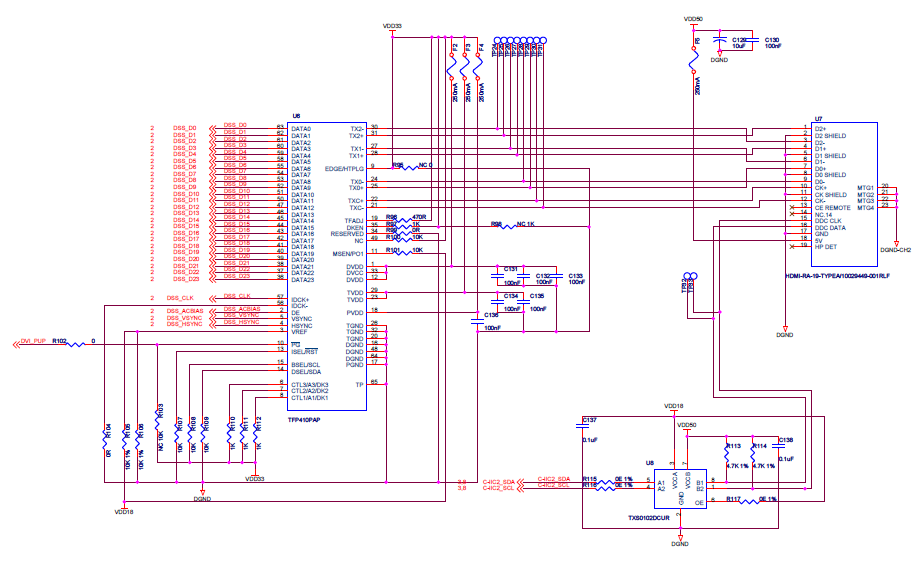
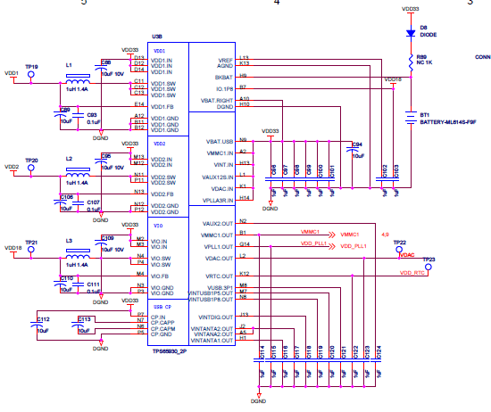
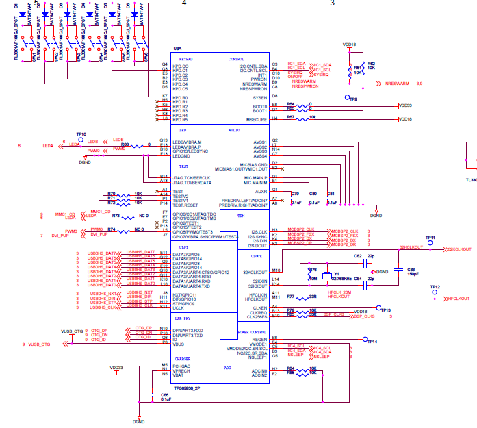
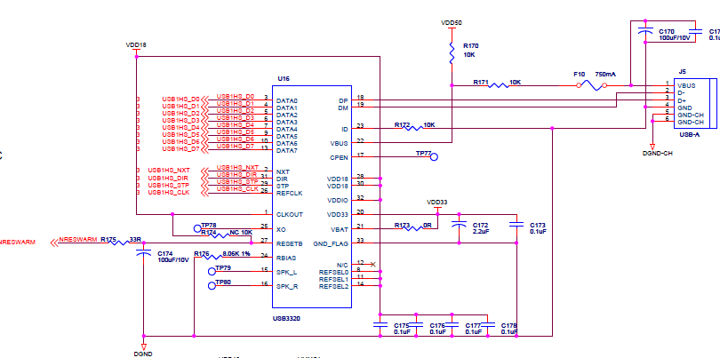
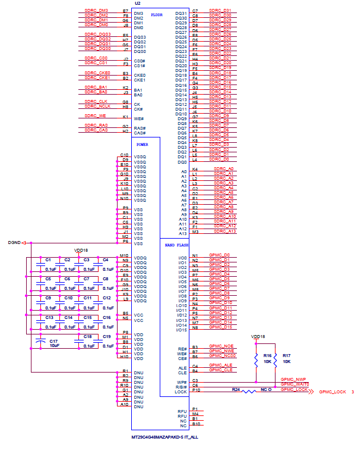
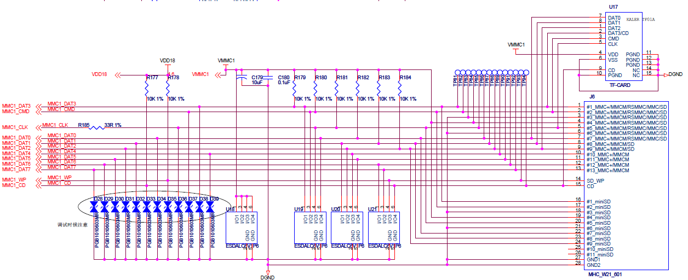

# 系统硬件平台设计

本文第 2 章已经对系统的硬件电路总体设计框架作了详细介绍，以及对主要芯片的
选型作了分析与介绍，并确定具体使用芯片型号。本章在上述的基础上将对硬件系
统的主要模块设计过程分别进行介绍，包括设计原理，设计步骤等。

## 硬件电路模块划分

按照系统硬件设计框架，硬件平台共分为两个部分，分别是前端视频采集模块电路
和基于处理器的硬件平台电路。按模块划分大概可以为以下几个模块：采集模块、
处理器模块、电源模块、USB模块、HDMI模块、MMC存储卡模块、网络模块、存储模
块、JTAG调试模块、串口模块以及复位电路等。模块划分结构如图
[@fig:ch3hwmodule] 所示。

{#fig:ch3hwmodule}

## 硬件主要模块设计介绍

### 视频采集模块电路设计

视频采集模块单独制板，通过FPC扁平线连接至主板。视频采集传感器采用APTINA
公司的像素CMOS传感器MT9P031。DM3730通过专用的视频采集片内外设ISP控制
MT9P031工作，并接收视频信号。MT9P031工作在高速模式下，其IO管脚电压为
\SI{2.8}{V}（资料显示MT9P031的IO管脚电压也可为 \SI{1.8}{\volt}，但只能工
作在低速模式下），与DM3730的IO管脚电压（\SI{1.8}{\volt}）不一致。MT9P031
和DM3730电路连接时，采用SN74AVCH16T245GR等电压转换芯片进行IO电压转换。

MT9P031芯片工作需要 \SIrange{6}{27}{MHz} 的时钟频率，该频率也可以由
DM3730的ISP 接口提供。为了调试方便，在系统设计时增加外部晶振电路，频率采
用MT9P031推荐的 \SI{24}{\mega\hertz}。视频采集模块电路的原理图如图
[@fig:ch3videoiptsch] 所示。

{#fig:ch3videoiptsch}

由于CMOS传感器对电源质量比较敏感，如果电压波动较大，会影响视频图像的输出
及芯片工作稳定性和寿命。MT9P031对供电电源要求为数字电源 \SI{1.8}{V} 和模
拟电源 \SI{2.8}{V}。系统特意通过2片LTC3025EDC把 \SI{5}{\volt} 电源转换为
\SI{1.8}{V} 和 \SI{2.8}{V}，分别独立提供稳定的、隔离的数字电源和模拟电源。

### 基于处理器的硬件平台设计

基于处理器的硬件平台主要实现对采集的视频数据进行处理、显示、存储以及传输
等功能。处理器模块采用的是TI公司的TMS320DM3730芯片，该芯片采用PBGA封装，
共有423个引脚，\SI{1.8}{\volt} 电压供电。

芯片电源由TPS65930电源芯片提供。TPS65930片内外设I2C接口与处理器的I2C接口
相连，进行两者之间必要的数据传输。

DDR存储器与处理器DDR部分SDRC引脚连接；FLASH存储器与处理器的GPMC引脚连接；
MMC存储卡模块与处理器的MMC部分数据引脚相连接；串口模块与处理器的UART1
部分引脚相连；JTAG调试模块与处理器的JTAG部分数据引脚相连接；处理器ISP接
口和视频采集模块连接。

#### HDMI模块电路设计

系统中高清视频数据处理后通过 HDMI (High Definition Multimedia
Interface) 接口输出显示。该接口是一种数字化视频/音频接口技术，是适合影像
传输的专用型数字化接口，可以同时传输视频和音频信号，最高传输数据位
\SI{5}{Gbps}。由于处理器处理后的数据并不能够直接通过HDMI输出显示，需要对
其重新编码成HDMI输出的数据格式。本系统选择了TI公司的TFP410编码器，该芯片
集成了高速数字接口、T.M.D.S. 编码器和三个差分信号驱动器，完成24位像素数
据和一些控制信号接收，并通过编码算法把图像信号编码成适合在双绞线电缆上传
输的高速、低电压、差分连续位流(RGB数据流)，是用于图形控制，无胶合连接的
通用接口。其接口的特性优势是可选择总线宽度，可适应不同的电平信号和信号沿
时序，适应 \SI{1.1}{V}-\SI{1.8}{V} 范围内的数字电平low-EMI，高速总线宽度
提供12位或者24位宽度选择，在24位真彩色格式的范围内，HDMI显示分辨率频率高
达 \SI{165}{MHz} [@haoyaru2007]。

TFP410支持从VGA到UXGA的分辨率，支持两种输入模式：12位双边和24位单边，可
由状态引脚配置也可以由I2C总线配置。12位双边是在输入时钟的每个沿12位数据就
会被锁存，24位单边是在输入时钟的上升沿或下降沿锁存。在本系统中设计为24位
单边输入，这两个引脚BSEL=1，EDGE=1需要设置为高电平。

具体电路连接中：TFP410PAP的IO口电压可以工作在 \SI{1.8}{V}，
TFP410PAP和DM3730之间可以不接桥接芯片。而DM3730对HDMI外设的IIC接口控制需
要采用电压转换芯片TXS0102DCUR，因为HDMI外设的IO电压为 \SI{3.3}{V}。具体
原理图设计见图 [@fig:ch3tfp410sch]。

{#fig:ch3tfp410sch}

#### 电源模块电路设计

由第 2 章的元器件选型分析中可知，硬件电源模块选用的是TI公司的TPS65930电源
管理芯片，该芯片主要为硬件电路提供 \SI{1.2}{V}、\SI{1.8}{V}、\SI{3.3}{V}
等电压，同时该芯片支持电源管理控制器、USB高速传输控制、LED驱动控制、模数
转换（ADC）、实时时钟（RTC）和嵌入式时钟管理（EPC）等功能，所以在本设计
中充分利用这些扩展功能，可以减轻处理器的负担，并能提高系统处理速度。本系
统中扩展了USB、LED显示灯、ADC、按键、时钟等功能。电源管理芯片原理图设计
是按电源模块和扩展功能模块设计，如图 [@fig:ch3tps65930sch] 和图
[@fig:ch3tps65930exsch]。

{#fig:ch3tps65930sch}

{#fig:ch3tps65930exsch}

#### USB 模块电路设计

系统的USB电路设计采用USB3320作为USB2.0控制芯片，支持USB
HOST接口，支持高速（\SI{480}{\mega\hertz}），全速（\SI{12}{MHz}），和低
速（\SI{1.5}{MHz}）模式。

USB3320是高度集成的全功能高速USB2.0收发器，基于SMSC成熟的ULPI接口构建，
支持多种参考时钟频率，可以接受来自晶振/振荡器的时钟讯号。USB3320集成有一
个USB切换器和ESD与VBUS过电压保护装置。USB模块电路设计的原理图见图\ [@fig:ch3usbsch]。

{#fig:ch3usbsch}

#### 存储模块电路设计

存储芯片选择的是MT96MAZAPCJA-5，该芯片是SDRAM DDR和NAND FLASH二合一的存
储芯片，空间大小分别为 \SI{512}{\mebi\byte}。SDRAM DDR是通过SDRAM
Controller (SDRC) 实现对数据的访问，而NAND FLASH是通过GPMC总线实现对数据的
访问。

SDRAM DDR是双倍速率同步动态随机存储器，相比与SDRAM一个周期只传输一次数据，
该存储器在一个周期内传输两次数据。NAND FLASH读写速度快，是非易失存储器，
可以对块的存储器单元块进行擦写和再编程。系统中以NAND FLASH来存储
Bootloader、操作系统、程序代码等。

芯片的SDRAM DDR和NAND FLASH模块的数据引脚与控制引脚分别与处理器的SDRC和
GPMC引脚相连。芯片采用 \SI{1.8}{V} 电压供电。存储模块电路设计原理图见图
[@fig:ch3storagesch]。

{#fig:ch3storagesch}

#### MMCI 存储模块电路设计

系统中读取的视频数据或抓拍的图片数据可以通过网络传输到远端系统也可以存储
在内存卡中。现在通用的存储卡有SD卡和TF卡。SD卡拥有高记忆容量、快速数据传
输率、灵活性以及很好的安全性。TF卡 (Trans Flash) 是摩托罗拉与SANDISK共同
开发推出的超小型存储卡，约为SD卡的1/4。TF卡经过SD卡转换器后可以当SD卡使
用。

SD卡的数据引脚与TF卡的数据引脚通用，本设计中同时支持TF卡和SD卡，共同的数
据引脚都与处理器的MMCI部分相连接，在时钟的控制下，输出数据。电路中增加了
几个LED指示灯，作为信号灯指示作用。SD卡与TF卡的存储模块电路设计原理图如
图 [@fig:ch3mmcisch]。

{#fig:ch3mmcisch}

## 小结

本节主要介绍硬件平台设计过程，首先介绍系统硬件平台模块划分，然后对主要几
个模块电路的设计过程进行介绍，分别介绍了视频采集模块电路设计、MMCI存储模
块电路、HDMI模块电路设计、电源模块电路设计、USB模块电路设计和存储模块电
路设计等。
