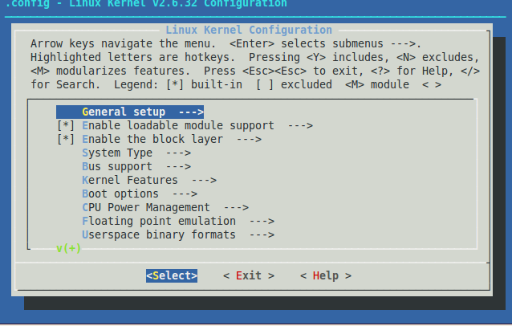
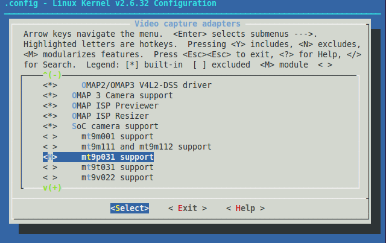
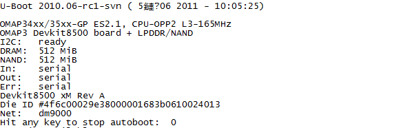

#  嵌入式 Linux 软件开发平台搭建

系统软件开发平台搭建主要分为交叉编译环境建立、嵌入式Linux系统内核裁剪与
移植、系统引导程序编译与移植、根文件系统制作以及NFS、Samba服务器安装与配
置。本章将分别对以上内容进行介绍。

## 嵌入式Linux开发环境搭建

### 交叉编译环境搭建

建立交叉编译环境是嵌入式Linux开发的前提，这是由于嵌入式系统资源有限，程
序设计无法直接在嵌入式Linux环境下编译，必须将程序在通用计算机上编译生成
二进制可执行文件，下载到嵌入式系统中才可以执行。前者通用计算机一般称为宿
主机，后者一般称为目标机。编译好的二进制可执行文件一般通过两者之间的连接
端口及连接工具如串口、网口、USB接口及JTAG口等进行下载调试。如图
[@fig:ch4crossinter] 所示为系统交叉编译环境搭建连接图。

{#fig:ch4crossinter}

由上图可知，搭建系统软件编译环境由宿主机和目标板以及几种通信接口组成，各
个模块介绍如下：

(1) 宿主机开发系统是在WIN7主机下的VMware虚拟机中安装Linux操作系统，该操
    作系统选用的是 Ubuntu10.04 LTS 版本操作系统。该系统是长期支持版本，
    性能稳定，适合dm3730开发。

(2) 目标板选用的是天漠公司Devkit8500系列评估板，系统软件首先在评估板上开
    发，待硬件制作好以后，将软件系统移植过去。目标版中嵌入式Linux操作系
    统使用的是内核版本。

(3) 由于宿主机是x86体统结构而目标板为ARM体系结构，在宿主机下编译的程序无
    法直接在目标板中运行，必须是有交叉编译工具来编译程序，本系统使用的是
    arm-eabi-gcc 交叉编译工具。

(4) 串口和网络调试工具使用的是SecureCRT调试工具，该调试工具不仅可以作为
    串口工具使用，设置波特率、数据位、停止位、奇偶校验等，还可以作为网络
    调试工具，利用telnet功能，实现网络调试。

### NFS服务配置

NFS (Network File System) 网络文件系统，最早是由Sun发展出来，它的最大功
能就是通过网络，让不同的操作系统共享自己的文件，所以也可以将它看做一个文
件服务器（File Server），这个文件服务器可以让远端的主机通过网络挂载到本
地主机上，共享该文件。本系统中将建立NFS共享文件夹，在串口或网络调试工具
中输入挂载命令\
`mount -t nfs -o nolock 192.168.0.150:/home/nfs /mnt/nfs`\
挂载到目标板 `/mnt/nfs` 目录下，那么在目标板中就可以直接调试宿主机中编译
好的程序。这种调试方式可以方便系统开发，加快开发进度。NFS服务器配置方式
如下 [@nfscsdn]：

(1) Ubuntu系统中安装软件相对比较简单，只需要在终端中输入命令\
    `sudo apt-get install nfs-kernel-server`，系统自动下载安装。

(2) 安装结束后需要配置 `/etc/exports` 文件，该文件为NFS共享目录配置文件，
    输入命令 `sudo vim /etc/exports`，在打开的文件最后输入\
    `/home/nfs *(rw,sync,no_root_squash)`。`/home/nfs` 是要共享的目录，
    rw和sync等命令代表对该目录的读写权限，写入方式等配置，以及操作权限设
    定。

(3) 配置好以后通过下面的命令重启服务。

        $ sudo /etc/init.d/portmap restart
        $ sudo /etc/init.d/nfs-kernel-server restart

(4) 目标板上测试NFS，在调试窗口输入下面命令，查看该文件夹下是否是宿主机
    目录下的内容，如果有则表示配置成功。

        $ mount -t nfs -o nolock 192.168.0.150:/home/nfs /mnt/nfs
        $ cd /mnt/nfs
        $ ls

### Samba服务配置

Samba是Linux操作系统与Windows操作系统之间架起的一座桥梁，两者之间基于SMB
(Server Message Block) 协议，可以实现互相通行。由于系统软件开发是在
Windows系统下的虚拟机中开发，而编程环境一般使用SourceInsight软件在
Windows编写，然后在Linux环境下进行交叉编译，两者之间的通信就是利用Samba
服务。需要在Linux建立一个共享文件夹。本文系统中在宿主机 `/home/share` 目
录下建立共享文件夹。Samba服务器的建立同NFS相似，具体为如下步骤
[@sambasina]：

(1) 在Ubuntu系统终端中输入命令\
    `sudo apt-get install samba`\
    `sudo apt-get install smbfs`\
    系统自动下载安装。

(2) 创建共享文件夹

    ```
    $ mkdir /home/share
    $ chmod 777 /home/share
    ```

(3) 编辑Samba服务配置文件，需要打开 `/etc/samba/smb.conf` 文件，在末尾添加如下信息:

    ~~~
    path = /home//share
    public = yes
    writable = yes
    valid users = suda
    create mask = 0700
    directory mask = 0700
    force user = nobody
    force group = nogroup
    available = yes
    browseable = yes
    ~~~

(4) 重启Samba服务

        $ sudo /etc/init.d/samba restart

(5) Samba测试

    在Windows系统下，在文件管理器的地址栏中输入 `\\192.168.0.150`，其中
    IP地址为 Ubuntu系统中的IP地址，如果输入命令按回车后，显示share共享文
    件夹，则表明 Samba服务器配置成功。

## 嵌入式 Linux 内核裁剪与移植

系统内核是一个操作系统的灵魂，负责系统的进程调度、内存管理、文件系统及网
络系统管理等，可以满足嵌入式系统中绝大多数的复杂性要求，但是由于一般嵌入
式Linux内核大小有到等，而嵌入式系统硬件资源有限，就必须对内核进行重新裁
剪和配置 [@chenyp2006]。内核的裁剪与配置主要针对系统硬件资源和软件设计需
求，将内核中不需要的内容删除及重新配置，最后重新编译内核，生成镜像文件，
下载到目标板中。

### 内核的配置

在系统内核编译前需要对系统的内核进行配置，配置时需要根据系统实际需求，认
真配置每一项，如果配置不当，直接关系到系统能否正常启动，是否满足系统设计
需求等。配置内核除选择必须参数外，还需要将不需要的选项去除，比如视频驱动
可能支持很多种设备的驱动，就需要将不需要的驱动去除，以此减少内核空间，但
是如果内核里面没有该支持的驱动，就需要添加 [@wookey2002]。如本文选择的
Linux操作系统中没有对MT9P031图像传感器的驱动支持，就需要内核配置中对其添
加。需要在“defconfig”,“kconfig”和“makefile”等三个文件中添加配置数据。在
内核中三个文件的存储路径分别为
`arch/arm/configs/omap3_beagle_defconfig`，
`drivers/media/video/Kconfig` 和 `drivers/media/video/Makefile`。

在 `omap3_beagle_defconfig` 配置文件中添加如下配置信息：

    CONFIG_SOC_CAMERA=y
    CONFIG_SOC_CAMERA_MT9P031=y

在 `video/Kconfig` 视频驱动配置文件中添加如下配置信息：

```
config SOC_CAMERA_MT9P031
tristate "mt9p031 support"
depends on SOC_CAMERA && I
help
    This driver supports MT9P031 cameras from Micron.
```

在 `video/Makefile` 编译文件中添加修改如下编译文件信息：

~~~
obj-$(CONFIG_SOC_CAMERA_MT9P031) += mt9p031.o
~~~

修改好后，需要对系统内核重新编译。编译通过后，需要配置内核，选择刚才添加
的驱动文件，通常配置内核都是通过 `make menuconfig` 命令来进行图形化配置。
如图 [@fig:ch4kernelmconfig] 所示，在菜单中选择所需要的功能。

{#fig:ch4kernelmconfig}

按“Y”键选中功能，并将该驱动功能编译到内核中，系统启动后将添加该功能；“N”
取消该功能，系统编译时内核将不添加该功能；“M”功能为模块化编译功能，系统
编译后内核不添加该功能，而是生成 `*.ko` 文件的动态链接库，当系统启动后如
果需要使用该功能，就使用 `insmod` 命令添加该动态库，这种方式可以减少系统
内核空间。配置完成后系统会自动生成config配置文件。MT9P031配置界面如图
[@fig:ch4knlmt9p031] 所示，为了使初期调试方便，本系统中对MT9P031选择的M
模式，这样每次修改驱动文件后，就不需要重新编译内核，但在后期成品时需要将
该驱动编译到系统内核。

{#fig:ch4knlmt9p031}

### 内核的编译与移植

内核配置完成以后，就需要对系统内核进行编译，在编译前可以通过命令
`export $PATH` 来查看交叉编译工具 `arm-none-linux-gcc` 是否添加，如果没
有，则需要见该工具添加，使用的命令为
`export PATH=$PATH:/opt/arm-q2003/ arm-eabi-4.4.0`。确认好编译环境后，开
始对内核编译。首先使用命令 `make distclean`，清除以前编译遗留下的文件，
然后输入命令 `make` 进行编译，编译好后将在 `arch/arm/boot` 目录下生成
`uImage` 镜像文件。本系统是将该镜像文件拷贝到TF卡上，通过TF卡实现系统更新。

## 引导加载程序移植

### Bootloader的作用

Bootioader为启动引导程序，是系统加电以后运行的第一段软件代码，用于完成硬
件的基本配置以及引导内核系统的正常启动，通常从0x00000000地址开始执行。在
嵌入式系统中，通常并没有像PC机BIOS那样的固件程序，因此整个系统的加载启动
任务就完全由BootLoader来完成。大部分Bootloader工作模式有启动加载模式和下
载模式两种 [@liulei2007]。加载模式是系统将存储在FLASH存储器上启动程序自
动加载到RAM中运行，整个系统启动过程不需要用户参与，产品发布时必须在这种
模式下工作。下载模式则是系统上电后通过串口或网口从宿主机上下载文件，下载
的文件通常先保存在目标机的RAM中，然后再写到目标机的FLASH存储器中，同时向
用户提供一个命令接口。Bootloader工作过程一般包含以下步骤 [@litao2011]：

(1) 硬件设备初始化。主要是为下一阶段执行做准备，包括准备RAM空间；
(2) 复制第二阶段代码到RAM空间；
(3) 设置堆栈；
(4) 跳转到第二阶段的C程序入口点；
(5) 开始第二阶段，初始化硬件设备；
(6) 系统内存映射检测；
(7) 读取FLASH中内核镜像及根文件系统到RAM空间；
(8) 设备启动参数及调用内核；

Bootloader可以自己设计开发，但一般都是选用公用的进行裁剪与修改后使用。比
较著名的公用Bootloader有三星公司的vivi、摩托罗拉公司的dBUG、国产软件
RedBoot和自由软件u-boot等。本文选用u-boot作为系统引导加载程序。

### u-boot编译与参数设置

u-boot是现在比较流行且功能强大的一款BootLoader，体积小，易于构造。本文
u-boot 使用的是 03.00.02.07 版本。编译步骤为：

(1) 解压u-boot压缩包，命令为 `tar xvf u-boot03.00.02.07.tar.bz2`;
(2) `make distclean`;
(3) `make omap3_devkit8500_config`;
(4) `make`;

当系统编译成功后会生成uboot.bin文件，可以通过tftp下载或拷贝到TF卡中，使
用TF卡实现更新。系统更新后，上电重新启动，出现如图 [@fig:ch4ubootprint]
界面时，点击任意键实现对u-boot参数配置。参数设置包括IP地址设定，内核启动
参数以及串口波特率设置等，部分参数设置如下：

~~~
# setenv serverip 192.168.0.150 设置 PC 机 tftp 服务器 IP 地址
# setenv ipaddr 192.168.0.103 设置开发板 IP 地址
# setenv ethaddr 00:10:20:18:ce:05 设置开发板 MAC 地址
# setenv baudrate 9600
# saveenv 保存以上环境参数到 flash
~~~

{#fig:ch4ubootprint}

因为本文系统使用的是TI OMAP系列双核处理器，处理的ARM核和DSP核之间需要互
相通信，需要使用TI的DVSDK开发工具，也需要配置u-boot启动参数，主要是对内
存的配置，配置命令如下：

```
# setenv bootargs console=ttyS2,115200n8 root=/dev/mmcblk0p2 \
    rootfstype=ext3 rw rootwait mpurate=1000 mem=99M@0x80000000 \
    mem=128M@0x88000000 omapdss.def_disp=lcd \
    omap_vout.vid1_static_alloc=y omapfb.varm=0:3M
# setenv bootcmd 'mmc init; fatload mmc 0 80300000 uImage; bootm 80300000'
# saveenv
```

配置好后，输入 `boot` 命令，系统进入内核启动过程，开始正常启动。系统正常
启动后将进入系统后台运行界面，这时就可以正常对系统进行开发与测试。

## 根文件系统制作

### 根文件系统简介

文件系统是对存储设备上文件操作的一种方法。内核启动后，第一个挂载的文件系
统就是根文件系统，内核代码的映像文件都保存在根文件系统当中，如果嵌入式
Linux系统没有根文件系统将不能正常启动。与PC机不同，嵌入式系统一般使用
Flash作为自己的存储介质，而不同的Flash存储器有不同的物理特性，所以支持
Flash的文件系统有很多，主要有EXT2、EXT3、JFFS2、CARMFS、UBI等。本文根据
系统的实际需求及硬件配置情况选择了UBI文件系统[@yangyj2005; @zhangxiang2005]。

Linux源代码是以文件的形式存放在根文件系统的各个目录中，根文件系统的结构
如图 [@fig:ch4rootfstree] 所示。

{#fig:ch4rootfstree}

### UBI 文件系统制作

首先在宿主机上建立一个文件夹，将所有生成的文件和子目录都放在该文件夹下，
然后通过如下命令将文件拷贝到该目录下。

    $ mkdir /home/share/ubi
    $ cp /media/cdrom/linux/tools/mkfs.ubifs /home/share/ubi
    $ cp /media/cdrom/linux/tools/ubinize /home/share/ubi
    $ cp /media/cdrom/linux/tools/ubinize.cfg /home/share/ubi

因为该文件系统支持OMAP3530系列的芯片，可以直接进行编译，输入如下：

~~~
$ cd /home/share/ubi
$ sudo /home/share/ubi/mkfs.ubifs -r rootfs -m 2048 -e 129024 -c 1996 -o ubifs.img
$ sudo /home/share/ubi/ubinize -o ubi.img -m 2048 -p 128KiB -s 512 \
  /home/share/ubi/ubinize.cfg
~~~

执行完以上操作后，在当前目录下会生成所需要的ubi.img文件，其中，`-o` 指定
输出的image文件名ubi.img，`-e` 表示设定擦除块的大小，`-m` 为页面大小，
`-p` 为物理擦除块大小，`-s` 为最小硬件输入输出页面大小。本文文件系统也是
通过TF卡进行更新。

## 小结

本章详细阐述了嵌入式Linux系统软件开发平台的构建过程，包括交叉编译环境的
建立，以及Samba、NFS服务器的配置，接着详细介绍了嵌入式Linux系统内核的裁
剪与移植和BootLoader引导程序的编译与参数配置过程，最后介绍文件系统的制作，
并列出了根文件系统的结构。
