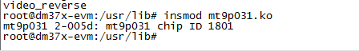
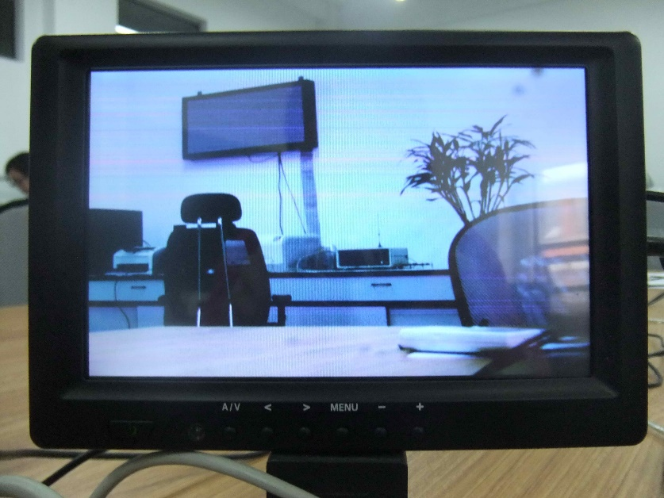
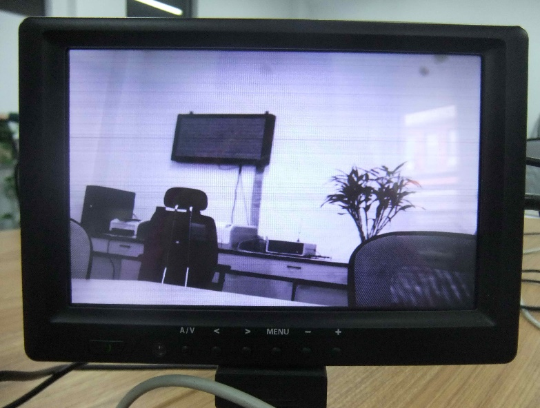
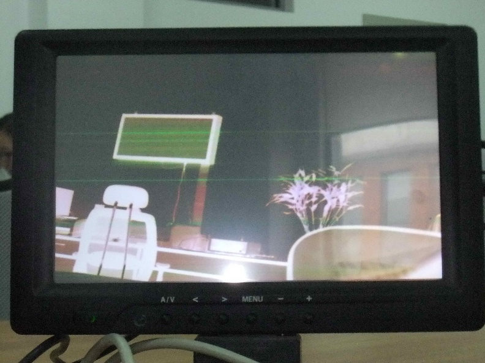
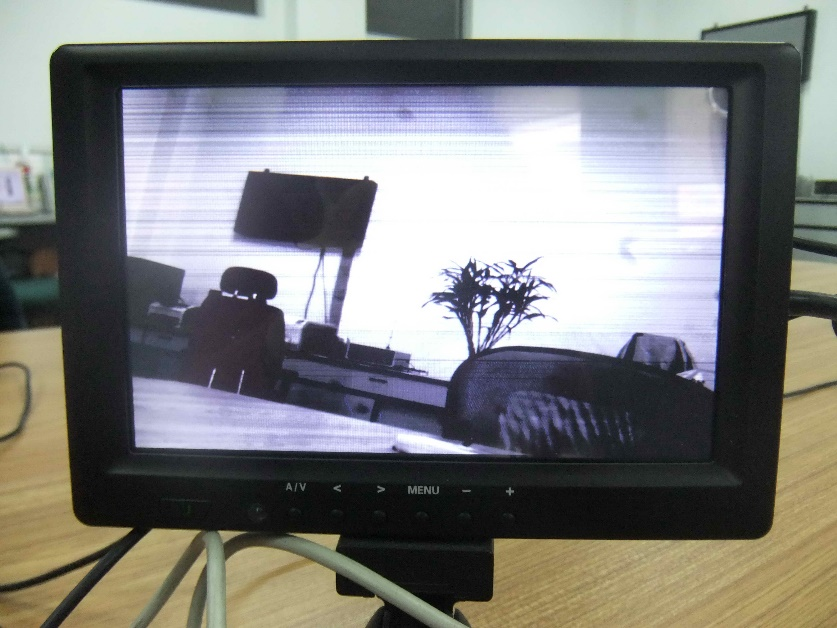
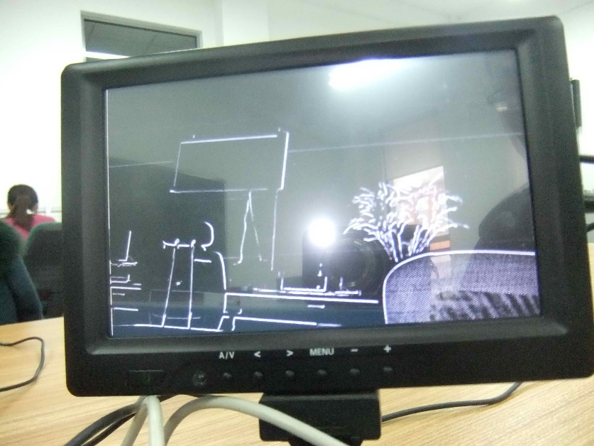
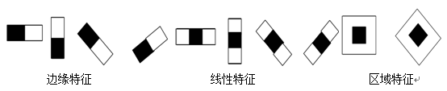
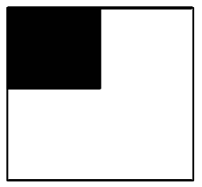

# 系统软件设计及算法实现

## 视频采集驱动程序设计

由第 2 章分析可知，本文选用MT9P031 CMOS图像传感器作为系统视频采集传感器，
而该传感器在嵌入式Linux内核版本中没有相应驱动支持，因此需要编写视频驱
动程序。由于视频采集程序是基于V4L2接口来设计，所以视频驱动程序需要在V4L2框架
下编程。本节主要概述Linux设备驱动框架，分类及常用加载方式，以及MT9P031
CMOS视频驱动详细设计过程。

### 驱动设备简介及分类

驱动程序是位于硬件与应用程序之间，实现对硬件进行控制与读取数据，并将数据
通过相应的接口提供给应用程序调用。在嵌入式Linux操作系统中所有的设备都可
以当成文件，所以应用程序通过驱动程序接口，可以对硬件像操作文件的方式进行
操作。驱动程序在系统中主要实现以下功能 [@zhouminjun2010]：

(1) 硬件设备的初始化和内存申请与释放等。

(2) 对硬件设备操作读取数据，并将读取的数据传输到内存缓冲，应用程序可以通
    过相应接口读取并处理，或者将上层发来的数据传输到硬件，实现对硬件的控
    制与操作。

(3) 对相应的中断进行检测，并做相应处理。

嵌入式Linux系统的设备驱动可以分为块设备、字符设备和网络设备等。块设备是
指可寻址、以块为访问单位的设备，有请求缓冲区，支持随机访问而不必按顺序读
取数据，一般存储设备都属于块设备 [@dongzhiguo2006]。常见的块设备有各种硬
盘，RAM，FLASH等。字符设备是指能像字节流一样读取数据的设备，不需要请求缓
冲区，只能顺序读写。常见的字符设备有串口、鼠标、键盘等。网络设备是比较特
殊的设备，它是面向报文而不是面向流，不支持随机访问，没有请求缓冲区。网络
设备也叫做网络接口，应用程序是通过Socket套接字而不是设备节点来访问网络设
备。本系统设计的MT9P031驱动属于字符设备，是实现对数据流进行操作。

### 驱动加载方式

在Linux操作系统中将驱动程序加载到内核有两种方式 [@dongzhiguo2006]，分别
为静态加载和动态加载，这两种方式的开发过程有些不同，也各有特点。

静态加载方式就是将驱动程序的源代码放到内核源代码中，在内核编译时和内核一
同编译，使该驱动成为内核的组成部分，系统开机后会自动加载注册驱动。这种静
态连接方式会增加内核的大小，且如果修改驱动，还需要重新编译内核，但在系统
发布时一般采用该方式。

动态加载方式是指将驱动程序编译成一个可加载和可卸载的目标模块文件，它可以
在内核运行时，再动态加载到内核中。用户可以可以使用insmod命令将驱动程序的
目标文件加载到内核，在不需要时可以用rmmod命令卸载，操作比较方便。在前期
开发阶段一般使用这种方式来加载驱动，这样方便系统开发，每次修改驱动后不需
要重新编译更新内核，只需要重新编译驱动即可。

### 驱动程序设计

本系统设计的MT9P031图像传感器驱动属于字符设备，如图
[@fig:ch5mt9p031driverblock] 表示该驱动在软件系统中的结构。可以看到该驱
动在底层硬件与上层内核和应用程序之间，需要实现与底层硬件和上层应用软件之
间通信。

{#fig:ch5mt9p031driverblock}

同一般的视频驱动程序一样，MT9P031图像传感器的驱动程序分成两部分，分别为
传感器驱动和视频功能驱动。传感器驱动为上层硬件接口驱动，实现对硬件初始化
与控制。视频功能驱动为硬件设备本身支持的功能。驱动程序被编译后直接加载到
内核或生成动态模块 (mt9p031.ko) 加载，加载注册成功后会生成一个设备节点，
通过该设备节点，系统应用程序利用API接口来调用设备驱动接口函数，发送命令
或者读取实时视频数据。微处理器通过I2C总线配置图像传感器的内部寄存器，实现
对图像传感器的参数配置和初始化。

由于视频采集程序将使用 Linux 系统为专门视频设备开发提供的 V4L2（video 4
Linux 2）架构，该架构为 Linux 下开发视频设备程序提供了一套接口规范
[@liudc2011]。这就要求我们的视频驱动程序要符合 V4L2 标准的规范和要求，
所以本系统中的视频驱动程序都是依据V4L2标准和规范来设计。

#### 图像传感器驱动设计

图像传感器驱动设计主要是实现对MT9P031芯片的控制，包括对芯片的注册、注销
、初始化等操作。处理器的ISP接口与MT9P031相连，通过I2C总线对芯片进行控制。
该图像传感器驱动设计主要使用的结构体为 `struct i2c_driver mt9p031_i2c_driver`，
结构体的内容如下：

```c
static struct i2c_driver mt9p031_i2c_driver = {
    .driver = {
        .name = "mt9p031",
    },
    .probe = mt9p031_probe,
    .remove = mt9p031_remove,
    .id_table = mt9p031_id,
};
```

其中 name 表明该驱动的名称；probe 是驱动程序的探测指针，该函数最重要的操
作是通过 `soc_camera_host_register` 注册一个 `struct soc_camera_host`，
也就是注册一个设备节点，主要功能是在CMOS设备上电启动后，将查找相匹配的驱
动程序，如果找到 `mt9p031_probe()` 函数，则完成mt9p031图像传感器的初始化
和注册；`remove` 函数是卸载函数，当通过rmmod等指令卸载驱动程序时，需要调
用 `mt9p031_remove()`，该函数主要完成内存释放和资源回收工作； `id_table`
表示该驱动所指的设备类型。

`mt9p031_remove()` 和 `mt9p031_id()` 程序如下：

```c
static int mt9p031_remove(struct i2c_client *client)
{
    struct mt9p031_priv *priv = i2c_get_clientdata(client);

    v4l2_int_device_unregister(priv->v4l2_int_device);
    i2c_set_clientdata(client, NULL);
    mt9p031_sysfs_rm(&client->dev.kobj);

    kfree(priv->v4l2_int_device);
    kfree(priv);
    return 0;
}

static const struct i2c_device_id mt9p031_id[] = {
    { "mt9p031", 0 },
    { }
};
```

当 `mt9p031_i2c_driver` 结构体中的函数都正确配置后，系统上电就会调用V4L2结
构体中的 `v4l2_device_register()` 将设备注册到内核，并产生设备节点
`/dev/video0`，表明CMOS设备注册成功。当卸载该驱动是会调用V4L2结构体中的
`v4l2_device_deregister()` 函数，将其注销，设备节点也就随着消失。

#### 视频驱动功能设计

视频驱动功能设计主要是实现对MT9P031芯片的V4L2的标准操作及ISP DMA的管理。
在V4L2的标准操作中主要使用V4L2架构下最重要的结构体 `struct video_device`，
该结构体代表一个视频设备。视频设备在系统中被当成一个文件来操作，包括
`open()`、`release()`、`write()`、`read()`、`mmap()`、 `ioctl()` 等，这
些文件操作功能都包含在 `file_operations` 结构体中。设备上电注册成功后，
系统应用程序就可以调用这些函数接口。对ISP DMA内存的初始化及内存分配，也
是通过 `ioctl()` 中的接口函数实现。

`open()` 函数的主要功能是通过inode中存储的次设备号来查找视频设备，并为设
备申请内存、中断号等资源。`open()`函数结构为\
`int (*open)(struct inode *inode, struct file *filp)`；

`release()` 函数主要是做减少引用次数的清理工作，并释放所申请的资源。

`read()` 和 `write()` 函数主要实现对视频数据的读写，将每帧视频数据以视频
流的方式送到应用程序可以访问的缓冲区，这是传输视频最有效方法，但是在视频
数据量比较大时，该方式执行比较缓慢，不能满足实现采集实时视频数据的要求，
于是采用了mmap 映射的方式传输数据。`mmap()` 函数是将内存空间直接映射到应
用程序空间，实现由应用程序直接对视频数据操作，而不需要将视频数据读写到应
用程序空间，这种方式会使执行效率会大大提高。

`ioctl()` 函数是一个接口函数，主要功能是对芯片操作实现视频采集功能。它是
V4L2架构中重要的接口函数，视频采集程序获取视频数据都是通过ioctl()接口函
数与驱动程序进行交互，实现视频数据采集。常用的ioctl命令见图
[@fig:ch5ioctlcmd]。

{#fig:ch5ioctlcmd}

在驱动程序结构体 `struct mt9p031_ioctl_desc` 中列出了本文设计的部分ioctl
功能接口函数，该结构体内容如下：

```c
static struct v4l2_int_ioctl_desc mt9p031_ioctl_desc[] = {
    { .num = vidioc_int_enum_framesizes_num,
    .func = (v4l2_int_ioctl_func *)mt9p031_v4l2_int_enum_framesizes },
    { .num = vidioc_int_enum_frameintervals_num,
    .func = (v4l2_int_ioctl_func *)mt9p031_v4l2_int_enum_frameintervals },
    { .num = vidioc_int_s_power_num,
    .func = (v4l2_int_ioctl_func *)mt9p031_v4l2_int_s_power },
    { .num = vidioc_int_g_priv_num,
    .func = (v4l2_int_ioctl_func *)mt9p031_v4l2_int_g_priv },
    { .num = vidioc_int_g_ifparm_num,
    .func = (v4l2_int_ioctl_func *)mt9p031_v4l2_int_g_ifparm },
    { .num = vidioc_int_enum_fmt_cap_num,
    .func = (v4l2_int_ioctl_func *)mt9p031_v4l2_int_enum_fmt_cap },
    { .num = vidioc_int_try_fmt_cap_num,
    .func = (v4l2_int_ioctl_func *)mt9p031_v4l2_int_try_fmt_cap },
    { .num = vidioc_int_g_fmt_cap_num,
    .func = (v4l2_int_ioctl_func *)mt9p031_v4l2_int_g_fmt_cap },
    { .num = vidioc_int_s_fmt_cap_num,
    .func = (v4l2_int_ioctl_func *)mt9p031_v4l2_int_s_fmt_cap },
    { .num = vidioc_int_g_parm_num,
    .func = (v4l2_int_ioctl_func *)mt9p031_v4l2_int_g_parm },
    { .num = vidioc_int_s_parm_num,
    .func = (v4l2_int_ioctl_func *)mt9p031_v4l2_int_s_parm },
    { .num = vidioc_int_g_ctrl_num,
    .func = (v4l2_int_ioctl_func *)mt9p031_v4l2_g_ctrl },
    { .num = vidioc_int_s_ctrl_num,
    .func = (v4l2_int_ioctl_func *)mt9p031_v4l2_s_ctrl },
    { .num = vidioc_int_queryctrl_num,
    .func = (v4l2_int_ioctl_func *)mt9p031_v4l2_queryctrl },
};
```

当把驱动程序编译好后，还需要对这两个文件 `board-omap3devkit8500.c` 和
`board-devkit8500-camera.c` 进行配置。该配置主要是对mt9p031图像传感器的
电源、ISP接口和时钟等参数的配置，以及对I2C总线信息添加，其部分函数如下：

mt9p031传感器isp接口和内存等参数配置结构体：

```c
static struct omap34xxcam_sensor_config mt9p031_hwc = {
    .sensor_isp = 0,//1
    .capture_mem = MT9P031_BIGGEST_FRAME_BYTE_SIZE * 2,
    .ival_default = { 1, 30 },
};
```

mt9p031传感器电源，时钟等参数配置结构体：

```c
struct mt9p031_platform_data devkit8500_mt9p031_platform_data = {
    .power_set = mt9p031_sensor_power_set,
    .priv_data_set = mt9p031_sensor_set_prv_data,
    .set_xclk = mt9p031_sensor_set_xclk,
};
```

I2C加载mt9p031传感器信息：

```c
#if defined(CONFIG_SOC_CAMERA_MT9P031) || \
    defined(CONFIG_SOC_CAMERA_MT9P031_MODULE)
{
I2C_BOARD_INFO("mt9p031", MT9P031_I2C_ADDR),
.platform_data = &devkit8500_mt9p031_platform_data,
},
#endif
```

当上面参数配置好以后，就可以实现将驱动程序编译进内核或者编译成内核模块动
态加载到内核，驱动注册成功后会在 `/dev` 文件下生成video0设备节点，并在调
试窗口打印出芯片ID号：1801，如图 [@fig:ch5vdrvload]。当然这个时候还无法
采集实时视频数据，还需要设计视频采集程序。

{#fig:ch5vdrvload}

## 视频采集与显示程序设计

本节主要介绍在V4L2框架下实现实时高清视频采集与显示的程序设计过程，首先对
V4L2的框架进行介绍，然后分别对视频采集与显示程序设计过程进行分析与介绍。

### V4L2介绍

V4L (Video for
Linux)，是针对音视频类设备在Linux系统中的一套标准编程接口，V4L2是V4L的升级
版本，它修正了V4L的一些缺陷，使该结构更加灵活，并于2002年左右在Linux版本内
核中添加了对该功能的支持，后被不断发展，可以支持越来越多的设备。V4L2是驱
动程序和应用程序之间的一个标准接口层，支持对大部分音视频设备的采集与处理
，包含CCD/CMOS图像传感器 [@schimek2008]。V4L2相关的设备及用途见图
[@fig:ch5v4l2devs]。

{#fig:ch5v4l2devs}

### 视频采集程序设计

视频采集程序的设计主要是实现将实时获取的原始视频数据通过ISP接口传输到处
理器存储单元，并可以实现对视频采集参数的查询与设置，如设置采集视频图像的
分辨率，视频格式等。视频采集程序的设计是参照V4L2提供的标准接口设计，该规
范可以提高程序的可读性和灵活性。

由于V4L2中ioctl命令都是采用结构化，流程化的方式，所以视频数据的采集也是
按照此方式设计，如打开设备、设置获取视频格式、申请缓冲空间、处理数据、开
始采集、停止采集、关闭设备等。视频采集程序中对视频数据的读写是采用mmap映
射方式，而不是read和write读写方式，这种方式是将缓冲区的地址指针映射到用
户空间，应用程序可以直接操作视频数据，而不需要把视频数据读写到用户空间，
这种方式可以大大提高处理数据的速度，对高清视频这样大数据量视频数据处理可
以起到事半功倍的效果。视频采集程序的设计流程图见图 [@fig:ch5vcapflow]。

{#fig:ch5vcapflow}

其具体实现的步骤如下：

1.  打开视频采集设备节点文件

        open((const U8 *) CAPTURE_DEVICE, O_RDWR);

2.  确认该设备具有的功能，比如是否具有视频输入，或者音频输入输出等。如果
    采集的设备不具有采集视频的能力等将会打印出错信息。

        ioctl(*capture_fd, VIDIOC_QUERYCAP, &capability);

3.  设置采集视频的制式及格式等，帧的格式包括宽度和高度等，制式包括YUV，
    RGB等。本文系统采集视频格式设置为 `V4L2_PIX_FMT_YUYV`，视频格式设置
    为 1280 $\times$ 720。

        ioctl(*capture_fd, VIDIOC_S_FMT, fmt);

4.  向内核申请采集视频数据帧缓冲，本文系统申请的是3个缓冲区，一般不超过5个。

        ioctl(*capture_fd, VIDIOC_REQBUFS, &reqbuf);

5.  为了可以直接操作采集到的视频数据，且不需要复制视频数据到用户空间，需
    要将每帧的帧缓冲数据映射到用户空间。

        mmap(NULL, buf.length, PROT_READ | PROT_WRITE, MAP_SHARED, 
             *capture_fd, buf.m.offset);

6.  为了便于存放采集到视频数据，需要将所有的帧缓冲入队列。

        ioctl(*capture_fd, VIDIOC_QBUF, &buf);

7.  开始对视频数据进行采集。

        ioctl(capture_fd, VIDIOC_STREAMON, &a);

8.  为了获得采集的原始视频数据，需要将采集数据的帧缓冲出队列。

        ioctl(capture_fd, VIDIOC_DQBUF, &capture_buf);

9.  为了循环采集视频数据，需要将出队列的帧缓冲重新入队列尾。

        ioctl(capture_fd, VIDIOC_QBUF, &capture_buf);

10. 停止对视频数据的采集。

        ioctl(capture_fd, VIDIOC_STREAMOFF, &a);

11. 对视频设备进行关闭，并解除内存映射。

        close(capture_fd);

通过以上步骤可以实现将采集到的视频数据送到申请的缓冲区中，并通过映射方式
将获取的数据由用户空间操作控制，并进一步对视频数据进行处理或输出显示。

### 视频显示程序设计

本系统设计采集的视频信号为高清视频信号，需要通过HDMI高清视频接口输出显示，
而系统内核支持HDMI接口输出，只需要在编译内核时选中VGA输出功能，所以本
程序的设计只需要将获取的高清视频数据或处理后的视频数据读取到输出缓冲区。
一般视频数据输出显示通过Framebuffer机制的/dev/fb0设备节点或者/dev/video1
设备节点。

Framebuffer被称为帧缓冲，可以直接对其数据缓冲区进行读写操作，与一般字符
设备没有什么区别，不必关心物理层显示机制和换页机制等问题。应用程序只需要
对这块显示缓冲区写入数据，就相当于实现对屏幕的更新。而/dev/video1设备节
点在本系统中与/dev/fb0设备节点相似，也是作为一个普通设备节点对其操作，只
需要对其显示缓冲区进行数据读写也可以实现数据的更新。由于本系统中fb0设备
节点需要作为界面显示使用，所以使用video1设备节点来显示视频数据。视频显示
程序也是通过映射方式将显示缓冲区的地址映射到用户空间，设计的流程同视频采
集程序设计流程相似，具体实现的步骤如下：

1.  打开显示video1设备节点文件

        open((const char *) DISPLAY_DEVICE, O_RDWR);

2.  取得显示设备的capability，确认是否支持该视频格式。

        ioctl(*display_fd, VIDIOC_QUERYCAP, &capability)		

3.  设置输出视频的制式及格式等，为了与采集的视频格式一致，本文系统输出视
    频格式设置为 `V4L2_PIX_FMT_YUYV`，视频格式设置为 $1280 \times 720$。

        ioctl(*display_fd, VIDIOC_S_FMT, fmt);

4.  向内核申请采集视频数据帧缓冲，本文系统申请的是3个缓冲区。

        ioctl(*display_fd, VIDIOC_REQBUFS, &reqbuf);

5.  通过内存映射，将申请的缓冲区映射到用户空间，用户空间就可以直接对缓冲
    区数据进行操作。

        mmap(NULL, buf.length, PROT_READ | PROT_WRITE, MAP_SHARED,
             *display _fd, buf.m.offset);

6.  开启视频输出显示

        ioctl(display_fd, VIDIOC_DQBUF, &display_buf);

7.  为了获得的处理后的视频数据，需要将采集数据的帧缓冲出队列。

        ioctl(capture_fd, VIDIOC_DQBUF, & display_buf);

8.  读写视频数据

        cap_ptr = capture_buff_info[capture_buf.index].start;
        dis_ptr = display_buff_info[display_buf.index].start;
        for (h = 0; h < display_fmt.fmt.pix.height; h++) {
            memcpy(dis_ptr, cap_ptr, display_fmt.fmt.pix.width * 2);
            cap_ptr += capture_fmt.fmt.pix.width * 2;
            dis_ptr += display_fmt.fmt.pix.width * 2;
        }

9.  为了循环处理后的视频数据，需要将出队列的帧缓冲重新入队列尾。

        ioctl(capture_fd, VIDIOC_QBUF, & display_buf);

10. 关闭视频输出显示接口

        ioctl(display_fd, VIDIOC_STREAMOFF, &a);

11. 关闭设备，并解除内存映射。

        close(display_fd);

按照上述设计的视频采集与显示程序编译后，会生成mt9p031.o目标文件，将该文
件通过NFS或者U盘下载到目标板中，输入 `./mt9p031` 命令后就可以实现实时显
示720p/30f高清视频图像，图 [@fig:ch5hdvideo] 为采集的视频图像。

{#fig:ch5hdvideo}

## 视频图像处理算法实现

针对不同的应用需求，需要对视频数据做相对应的处理，本文根据系统的总体设计
需求，需要实现以下五种视频处理，“黑白视频”、“底片视频”、“图像增强”、“边
缘检测”和“人脸跟踪”。

由于系统中视频数据输入的为RAW \SI{12}{bit} 数据，经过ISP的VPBE（video
process back end）视频后端硬件处理，将输出的视频数据格式转变为YUV4:2:2格
式，其中Y 代表亮度信号，U(Cb)代表蓝色色差，V(Cr)代表红色色差
[@chenshuh2005]。这种格式便于数据的传输与处理，其优点是与黑白图像兼容，
对于YUV格式像素，只需要取出Y分量输出显示，就可以得到黑白图像。本文的彩色
视频到黑白视频的转换就是通过此方式，而对于底片视频处理只需要将YUV的每个
分量值取反，就可以实现。由于这两种视频处理相对比较简单，就不对其进行具体
介绍，实现的视频图像如图 [@fig:ch5bwvideo] 和 [@fig:ch5invertvideo]，本
节主要介绍“图像增强”、“边缘检测”和“人脸跟踪”等算法分析与实现过程。

{#fig:ch5bwvideo}

{#fig:ch5invertvideo}

### 图像增强算法实现

#### 图像增强技术介绍

在视频图像采集传输过程中不可避免的会受到各种干扰，导致视频图像无法达到令
人满意的效果，为了实现人眼观察或者机器处理需要识别等目的，需要对原始视频
图像进行处理，这些都称为图像增强。图像增强包含非常广泛的内容，传统的图像
增强的处理方法可以分为基于空域的变换增强算法和基于变换域的图像增强算法两
大类。空域是指图像的像素组成集合，该类图像增强主要是直接对图像中像素灰度
值进行处理运算，常用的算法有灰度变换、直方图均衡化、直方图修正、图像锐化、
图像平滑和噪声去除等；频域图像增强是指对图像进行傅里叶变换后的频谱成分
操作，接着再进行逆傅里叶变换获得所需结果，常用的算法有低通滤波、高通滤波、
同态滤波以及带阻滤波等。由于图像增强有感兴趣的物体特性，图像增强算法的
应用也有针对性，不同应用场合应使用相对应的图像增强算法 [@castleman1979]。
为了满足图像的亮度增强特性以及系统硬件条件等限制，本文系统选择了直方图
均衡化算法实现对视频图像亮度进行增强。

#### 直方图均衡化算法实现

灰度直方图是数字图象处理中一个最简单、最有用的工具，它描述了一幅图像的灰
度级内容，该内容包含了客观的信息，甚至某些类型的图像可以完全由直方图来描
述 [@wangzy2006]。图像 $f(x, y)$ 中的某一灰度 $f_i$ 的像素数目 $t_i$ 所
占总像素数目 $T$ 的份额为 $t_i/T$，称为该灰度像素在该图像中出现的概率密
度 $p_f(f_i)$。

$$p_f(f_i) = t_i / T \quad i = 0,\,1,\,2,\,...\, N-1 $$ {#eq:ch5prodens}

其中 $N$ 为灰度级总数目，一般灰度图像灰度级为 0-255，这种纯灰度变化的函
数称为该图像的概率密度函数，该函数是梳妆直线，也被称为直方图。一帧灰度视
频图像中，其直方图概括了图像中各灰度级的含量，图像的明暗分配状态就可以直
接反映处理。为了改善整幅图像或者某些目标的对比度时，可以修改各部分灰度的
比例关系实现。本文采用的直方图均衡化是对整幅图像的灰度进行均衡化，如图
[@fig:ch5barpf] 所示，通过点运算使输入的直方图的灰度分布大体均匀，则整幅
输出的图像清晰度就会提高。

{#fig:ch5barpf}

灰度直方图均衡化算法简单来说就是把直方图的每个灰度级进行归一化处理，求每
种灰度的累积分布，得到一个灰度映射表，然后根据相应的灰度值来修正原来图中
每个像素 [@sunzh2004]。为了计算方便，需要对直方图归一化处理，即将灰度范
围由0\~255变为0\~1，归一化后的直方图就是概率密度函数PDF (probability
density function)，均衡化就是令概率密度为1。

设转换前图像的概率密度函数为 $p_r(r)$，转换后图像的概率密度函数为
$P_s(s)$，转换的函数为 $s=f(r)$，由概率论知识得到公式 [@eq:ch5eqps]：

$$P_s(s) = p_r(r) \cdot \frac{\mathrm{d}r}{\mathrm{d}s}$$ {#eq:ch5eqps}

这样，如果使转化后的图像概率密度为1，则必须满足公式 [@eq:ch5eqpr]：

$$p_r(r) = \frac{\mathrm{d}s}{\mathrm{d}r}$$ {#eq:ch5eqpr}

对等式两边积分可得到：

$$s = f(r) = \int_0^r p_r(u) \mathrm{d}u$$ {#eq:ch5eqsfr}

公式中的 $f(r)$ 代表 $r$ 的灰度积分变换函数，$u$ 为变量。公式
[@eq:ch5eqsfr] 也被称为累积分布函数，由 [@eq:ch5prodens] 概率密度函数可
得到直方图均衡化公式 [@eq:ch5barbal]：

$$s = f(r_k) = \sum_{j=0}^k \frac{t_j}{T}
    = \sum_{j=0}^k P_r(r_k)$$ {#eq:ch5barbal}

因为 $s$ 是归一化的数值 ($s \in [0,\,1]$)，要转换成0\~255的颜色值，需要
再乘上255。根据上述的直方图均衡化算法原理可知，该处理过程比较简单，其算
法实现部分只需要ARM处理单元就可以实现。该算法实现的流程图如图
[@fig:ch5barbaflow]。

{#fig:ch5barbaflow}

由该流程图可知，因为视频图像获取的每帧数据格式为YUV格式，所以在处理前先
开辟一个缓冲区，将YUV格式中Y亮度信号读写到新开辟的缓冲区，这样就是首先实
现了彩色视频到灰度视频的转换，然后将该缓冲区的视频数据按行读取，并同时进
行视频图像的直方图统计后，对该帧所有数据进行均衡化处理，并将处理后的结果
送到V4L2结构中的输出缓冲区中输出显示。以下为处理的函数结构：

    convert_to_white(tmpBuffer,tmpBuffer_1, WIDTH, HEIGHT) //灰度转换
    video_histogram_statistic(tmpBuffer_1, WIDTH, HEIGHT)   //直方图统计
    video_histogram_enhance(WIDTH, HEIGHT)             //直方图均衡化

视频的处理是按每帧进行处理的。图 [@fig:ch5postbaprc] 为直方图均衡化处理
后的视频图像。

{#fig:ch5postbaprc}

### 边缘检测算法实现

#### 边缘检测技术简介

边缘存在于基元与基元、目标与目标等之间，是指那些在灰度空间周围像素有屋顶
状或阶跃变化的像素结合，是图像中基本特征之一。因为边缘包含图像中大量信息，
比如形状，阶跃性质等，它们都是模式识别、机器视觉等研究领域所需求的重要
特征。边缘检测对物体的识别非常重要，获取图像边缘，可以使图像分析大大简化，
识别也比较容易，而且图像的纹理特性与边缘检测也有密切的关系
[@liming2009]。如何快速准确的提取图像边缘也是国内外相关领域的研究热点，
也有着比较长的研究历史，最早的边缘检测是二十世纪六十年代Roberts提出了基
于梯度的边缘检测，这种方法是基于对角方向相邻像素之差来计算梯度进行的，该
方法至今都在使用。二十世纪七十年代出现了Prewitt算子、Kirsch算子、
Robinson算子和Sobel算子等。Prewitt算子和Sobel算子在计算梯度前会先计算加
权平均或邻域平均，再进行微分，该方法可以抑制一些噪声，但处理的图像容易出
现边缘模糊。Kirsch算子可以检测多个方向上的边缘，该方法可以减少因取平均而
丢失的细节，但增加了计算量。以上的传统算子，因为是采用局域窗口梯度算子，
随着噪声增加，会检测出大量的伪边缘和噪声点，会影响边缘的检测效果。近年来，
很多学者提出了基于仿射变换和特征空间的边缘检测、基于小波变换的边缘检测
算法、彩色图像和三维图像边缘的检测研究等方法，如今检测算法正在不断的将新
方法和新概念引入，同时将现有的方法进行改进，以得到特定任务满意的检测结果
[@Canny:1987:CAE:33517.33534]。本系统选择比较常用的Sobel算子来实现。

#### 边缘检测算法实现

Sobel算子属于边缘检测局部算子法，一般使用基于方向导数掩模求卷积的方法。
在物体边缘处，它的邻域像素灰度级上将形成一个变化带，可以用灰度方向和变化
率两个特征来表示。Sobel算子将对邻域内每个像素的灰度变化率进行量化
[@wuguol2010]。对于数字图像 $f(x,y)$，Sobel算子的定义如下：设
$$A=| f(i-1,j-1)+2f(i-1,j)+f(i-1,j+1)-(f(i+1,j-1)+2f(i+1,j)+f(i+1,j+1))|$$
$$B=| f(i-1,j-1)+2f(i,j-1)+f(i+1,j-1)-(f(i-1,j+1)+2f(i,j+1)+f(i+1,j+1))|$$
选择两个值的最大值作为该点的输出位，
$$S(i,j) = \max(A, B)$$
则输出的图像为边缘图像。Sobel算子也可以用模版表示，模版中的元素表示算式
中相应像素的加权因子。模版如图 [@fig:ch5sobeltpl]。

{#fig:ch5sobeltpl}

由于这个算法运算量相对于ARM内核的处理器速度，运算量不是很大，所以算法在
ARM端实现，实现过程与图像增强算法实现过程相似，先开辟一个存储空间，将读
取的Y分量信号进行sobel算子算法处理后，输出到显示缓冲区，输出显示。图
[@fig:ch5edgedt] 为边缘检测显示图像。

{#fig:ch5edgedt}

### 人脸跟踪算法实现

人脸跟踪由人脸检测和人脸跟踪两部分构成。人脸检测就是将视频流中每帧视频中
人脸检测出来，并将人脸信息提供给人脸跟踪，而人脸跟踪根据人脸检测提供的人
脸信息对每帧视频中人脸进行实时跟踪，该跟踪算法是以前一帧中检测到人脸为基
础^[@zhangxue2011]^。

目前人脸检测方法大致可以分为四类 [@zhanglp2009]，分别为基于知识的方法、
基于局部特征的方法、基于统计学习的方法和基于模板的方法。基于知识的方法是
利用一些人脸的先验知识指定一定规则，再利用该规则检测出人脸，比较代表性的
算法为Kotropoulos和Pitas提出的人脸检测算法；基于局部特征的方法是基于人脸
的眼、鼻、嘴等不变的特征，在利用这些特征组成候选人脸区域，比较代表性的算
法是Kyoung-Mi Lee提出检测算法，该方法是利用人脸五官特征不变性的特征。基
于统计学习的方法是利用机器学习与统计分析的方法来训练有人脸样本和无人脸样
本的特征，然后根据统计特征构建模型来检测人脸，比较代表性的算法时Viola提
出的基于Adaboost方法训练人脸检测分类器的方法。基于模板的方法是根据模版来
计算模版与图像之间的相关系数，依照设置好的阈值判断是否有人脸存在。目前有
两种类型的模板：变形模板和预定模板，比较有代表性的算法时Miao和Yin等人提
出的一种基于多层次人脸模板的检测方法。

人脸跟踪方法主要分为基于模型和基于运动的两类方法。基于模型的跟踪方法是在
跟踪前根据已掌握的人脸知识构造人脸模型，通过该模型对每帧视频数据做匹配处
理。基于运动跟踪算法可以分为两种方法，分别为图像差分法和光流法，前一种方
法位置精确且速度较快，但受光照影响较大，而第二种方法适合于运动的物体，但
精确位置比较差，比较代表性的是Decarlo和Metaxas提出的算法。

本系统采用的是Adaboost人脸检测算法和CamShift人脸跟踪算法实现嵌入式人脸智
能跟踪。人脸跟踪算法软件流程如图 [@fig:ch5facetc]，其设计流程为系统启动
后开始采集实时高清视频图像，如果系统需要对视频作人脸跟踪处理，则首先通过
Adaboost算法对每帧视频进行人脸检测，如果检测到该帧视频数据中包含人脸，就
调用Camshift算法对人脸进行实时跟踪，如果没有检测到人脸则继续对每帧视频做
Adaboost算法进行人脸检测处理。

{#fig:ch5facetc}

#### Haar-like特征和特征值计算

由于人脸面部特定区域的灰度是有差异的，这种差异就可以作为标记人脸的特征，
同时为了尽量减小计算量和计算的复杂度，这种人脸特征应当尽可能的简单，所以
使用了类Haar特征，之后又得到扩展，目前类Haar特征主要分为：边缘特征、线特
征、中心包围特征等 [@lienhart2002]，如图 [@fig:ch5harrptn] 所示。

{#fig:ch5harrptn}

其中每个特征可按以下公式计算
$$\textrm{feature}_j = \sum_{i \in (1...N)}w_i \mathrm{Re} ctSum(r_i)$$
其中 feature$_j$ 代表的是第 $j$ 种Harr块的特征值，$w_i$ 为第j种Harr块的
权值，由于矩阵特征的特征值运算量大，所以采用积分图的方法，该方法可以快速
计算出haar-like特征值。如图 [@fig:ch5intpx]，已知输入图像I，在点 $(x, y)$
处的积分图像值定义如下。
$$\mathrm{ii}(x,y) = \sum_{x'\le x,y'\le y}i(x',y')$$

{#fig:ch5intpx}

对于一幅图像在任意点的积分图值，可以通过对行和列的累加一次循环得到公式。
$$s(x,y) = s(x,y-1) + i(x,y)$$
$$\mathrm{ii}(x,y) = \mathrm{ii}(x-1,y) + s(x,y)$$

#### Adaboost 算法实现

Adaboost算法的原理是从大量的类Haar特征中训练出描述人脸灰度分布的最优特征，
并作为弱分类器使用，多个弱分类器优化组合成强分类器，最后通过级联形成层
级级联分类器。训练是由一个个有人脸和无人脸训练样本构成，在图像检测过程中，
图像通过层层分类器的检测，全部通过检测区域即为目标区域
[@zhangzhong2008]。弱分类器构造如下：

对于每个特征 $j$，构造一个判决函数 $h_j(x)$，表示该分类器在该特征下的判
决输出，如下式所示。
$$
h_j(x) = \begin{cases}
1 & p_j f_j(x) < p_j \theta_j \\
0 & \textrm{otherwise}
\end{cases}
$$
其中 $h_j$ 为第 $j$ 轮训练得到弱分类器，表示该样本要不是真样本，要不就是
假样本。$f_j(x)$ 为类Harr特征的特征值，$\theta_j$ 为特征值的阈值，$p_j$
为不等式的方向。

训练目标是通过对判断得出的真假样本进行分析, 选择分类错误率最低的 $T$ 个
弱分类器，最终优化组合成一个强分类器，其训练步骤如下：

(1) 对训练样本中的图像，用 $(x_1,y_1)$, $(x_2,y_2)$, ..., $(x_n,y_n)$ 表
    示，其中 $y_j = 0,1$ 分别表示样本中非人脸和人脸样本，并分别对权值初
    始化为 $w_{1,j} = \frac{1}{2m}, \frac{1}{2l}$，其中 $m$，$l$ 分别表
    示非人脸和人脸样本在训练样本中的数目。

(2) 开始循环迭代：`For i = 1, 2, ... N`（N 为循环次数）

    利用AdaBoost算法获得弱分类器，并根据下式判断强分类器输出的正确率
    $$h(x) = \begin{cases}
    1 & \sum_{i=1}^T a_i h_i(x) \ge 0.5 \sum_{i=1}^T a_i \\
    0 & \textrm{otherwise}
    \end{cases}
    $$

    若正确率大于某一阈值并小于某一阈值时，则可以作为一个分类器。

(3) 进入下一个分类器的训练

    以此迭代循环，最终得到多级强分类器。

#### Camshift 算法实现

CamShift算法的核心是MeanShift迭代，是一种连续自适应移动算法。其原理是在
HSV格式视频数据中对目标在H通道的值进行采样，并算出该目标的颜色直方图，即
目标颜色查找表。通过该表可以获得目标像素在输入像素中的概率，然后利用
MeanShift迭代求出二维概率密度的局部最大值，计算出目标质心坐标，并且自适
应调整搜索窗口的大小 [@zhanglp2009]。在计算质心位置的同时，Camshift为得
到目标的长轴、短轴、方位，需要计算阶矩来获取二维空间的概率分布方向，计算
二阶矩公式如下：
$$M_{02} = \sum_x \sum_y y^2 I(x,y)$$
$$M_{20} = \sum_x \sum_y x^2 I(x,y)$$
$$M_{11} = \sum_x \sum_y xy I(x,y)$$
$I(x,y)$ 表示的是图像在点 $(x,y)$ 处的像素值，$x$ 和 $y$ 表示搜索窗口的
变化范围。图像中跟踪目标的短轴与长轴可通过下面两式得到。
$$l = \sqrt{[a+c+\sqrt{b^2+(a-c)^2}]/2}$$
$$w = \sqrt{[a+c-\sqrt{b^2+(a-c)^2}]/2}$$
其中 $a = Z_{20}/Z_{00}-x_c^2$, $b = 2(Z_{20}/Z_{00}-x_c y_c)$,
$c = Z_{20}/Z_{00}-y_c^2$, $\theta = \frac{1}{2}\tan^2(\frac{b}{a-c})$.

上述步骤可以得到每帧视频图像中椭圆参数和最优目标的匹配中心，利用这些参数
可以对输出的每帧视频中的该区域进行描绘，这就实现了对目标的持续跟踪。

#### 算法的移植与实现 

利用AdaBoost人脸检测算法和CamShift人脸跟踪算法实现人脸自动检测跟踪的设计
流程图 [@fig:ch5facedtflow]，首先从读取的视频流中获取一帧数据，利用
AdaBoost算法检测该帧数据中是否有人脸，如果没有人脸，则读取下一帧数据检测
，如果读取到的数据中包含人脸，则利用这次检测到的人脸窗口作为搜索窗口，并
计算该窗口的直方图和面积，并读取下一帧数据，利用CamShift算法对人脸进行跟
踪，如果该搜索窗口大于S/3小于5S/3则继续使用CamShift算法对人脸实时跟踪，
如果搜索窗口不在这个范围内，则重新读取一帧数据，再次使用AdaBoost算法进行
人脸检测，以此循环。

{#fig:ch5facedtflow}

根据系统设计要求，基于Linux操作系统，系统的高清视频采集与显示由处理器的
ARM内核单元实现，而人脸跟踪等算法则由处理器的DSP内核单元实现，两个内核之
间通过TI提供的Codec实现通信和交互。算法的实现主要分为三个步骤：首先将算
法在PC机下由C语言来实现并测试检测效果，然后在CCS编译环境下将编译好的算法
程序移植到处理器的内核单元并做优化包括浮点运算等，最后将该算法按照TI的
xDM标准进行封装，由处理器ARM内核单元的应用程序通过封装的接口实现对算法的
调用 [@xusheng2007]。

系统的软件设计基于高内聚低耦合，模块化的设计原则来设计，Adaboost算法和
Camshift算法主要由以下一些函数功能模块实现：

```c
typedef struct HaarFeature	 //定义特征结构
int GetHaarValue(int i, int j)  //计算第j个样本的第i个Harr特征值
void GetAllFeatureValue( ) //保存所有特征值
int GetWeakClassifier( ) //获取弱分类器
//对有人脸的样本库训练
void TrainFace(double t, double f , double d , int m , int n)
//对所有没有人脸的样本库训练
void TrainNoFace(double t , double f , double d , int m , int n)
int AdaBoost(int stage，int *stream) // adaboost检测
void GetTarget( int x, int y, int flags, void* param )//选择跟踪目标区域
int camshift() //camshift算法跟踪人脸
```

算法在PC机上实现以后，需要移植到处理器DSP内核，由于PC端支持浮点运算，而
DSP内核不支持浮点运算，需要对算法进行优化处理，将算法程序中用到的浮点运
算地方如分类阈值，人脸检测窗口等转化为DSP上的定点运算。算法优化好后，需
要对函数进行封装。图 [@fig:ch5pcfacetest] 为在PC机上测试的部分人脸跟踪效
果图像。

{#fig:ch5pcfacetest}

由于时间比较紧张，人脸检测与跟踪算法目前只是在PC机上实现，在嵌入式设备移
植部分工作还有待继续研究，由于采集的720P分辨率的视频数据太大，利用DSP处
理算法时运算耗时很大，可能人脸跟踪实时性不强。所以事先考虑采取在处理数据
时降低分辨率的办法，如果需要人脸检测时，首先分配个空间，对采集的每帧图像
作降维处理，并存入该空间，送到DSP核进行检测跟踪处理，并对处理后的结果标
记后，再由ARM核标记高清视频数据的位置，从而实现人脸的跟踪，该方法有待继
续研究。

## 小结

本章主要介绍了系统的视频驱动程序、视频采集与显示程序及视频图像处理的设计
与实现过程，首先详细介绍了视频的驱动结构以及加载方式等，接着介绍CMOS芯片
视频驱动设计过程，驱动程序设计加载成功后，接着介绍基于V4L2结构的视频采集
与显示程序设计过程，在视频图像成功采集与显示后，最后详细介绍了图像增强、
边缘检测及人脸跟踪算法的实现过程。
