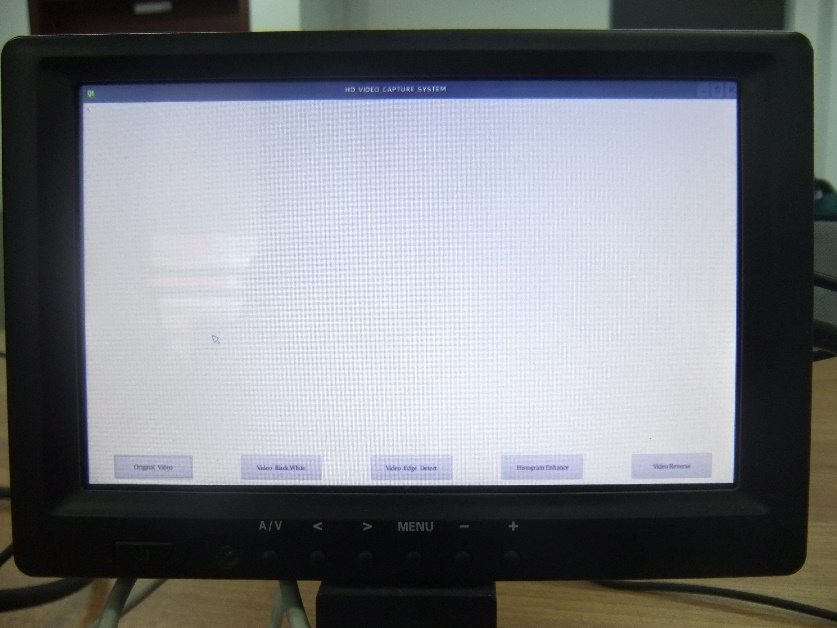
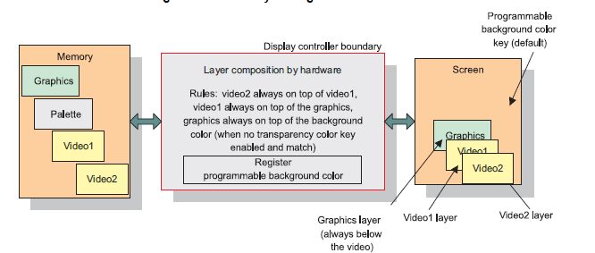
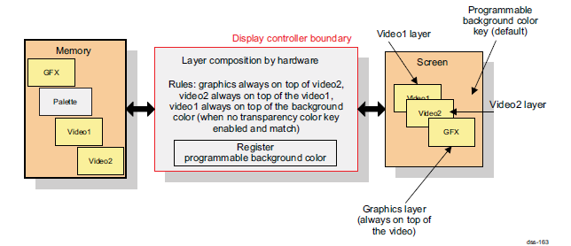
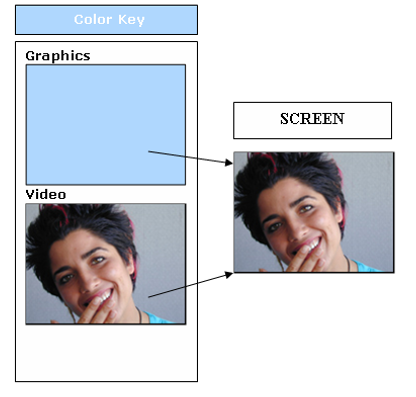
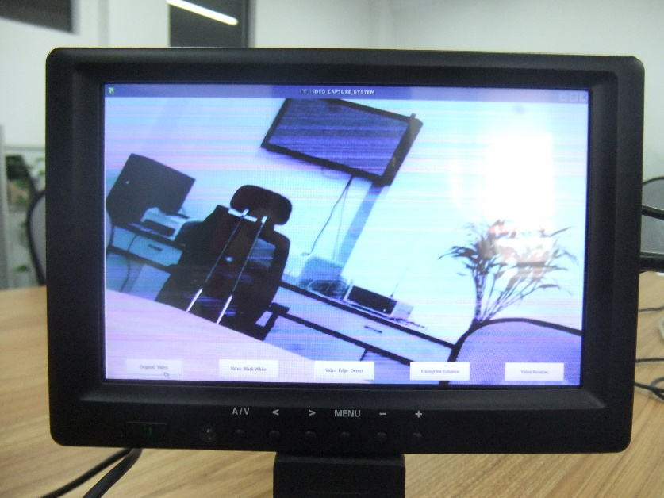

# Qt/E界面设计及OSD功能实现

在本文的第二章已经对现有的嵌入式GUI图像界面系统进行了分析与比较，最终选
择了Qt/E作为本文系统界面设计的图形系统，本章将分别介绍Qt/E图像系统，界面
的设计与实现过程以及OSD功能的实现。

## Qt/E介绍

Qt原是挪威TrollTech公司开发的一个用户界面框架和跨平台应用程序，后被诺基
亚收购。在被诺基亚公司收购前，TrollTech公司针对嵌入式环境开发了一套
Qtopia产品，但是被收购后，在其底层摒弃了X Window Server和X Library，于
2001年推出的嵌入式系统的Qt Embedded版本，即Qt/E版本，该版本Qt运行速度不
够快的缺点大力优化底层，大大提高了Qt/E的性能。Qt/E与Qt一样，都是采用C++
语言编写 [@chengjie2008]。Qt/E系统架构如图 [@fig:ch6qtecompo] 所示。

{#fig:ch6qtecompo}

总体来说Qt/E具有如下一些特点：

1.  跨平台、可移植性好\
    由于Qt与Qt/E上层开发接口相同，不涉及底层操作，Qt程序只需要通过交叉编
    译，便可以在嵌入式环境下运行，提高系统的移植与开发速度。

2.  丰富的API接口\
    由于Qt/E拥有和Qt一样的API接口，而其类库是采用C++封装，可以很方便的对
    其扩展。开发者只需了解Qt的API，不必关心嵌入式系统具体应用平台，使用
    十分方便。

3.  强大的开发工具\
    Qt提供了Kdevelop、Qt Designer和Qt Creator等开发工具。

4.  拥有自己的图形库\
    Qt/E拥有自己的图形引擎，而不需要任何额外的图形库，所以可以直接底层的
    FrameBuffer进行操作。

5.  支持不同的输入设备\
    Qt/E对输入设备进行抽象，屏蔽不同输入设备，支持将外部事件全部抽象为内
    部定义的输入设备事件，支持常用的键盘、鼠标等。

## Qt/E界面设计与实现

#### Qt/E界面设计

为了方便用户使用不同的视频处理功能，需要设计一个人机交互界面，而由于该界
面需要实现OSD功能，所以要求设计的界面简洁明了。在本系统中主要是切换不同
的视频处理功能，所以该界面只需要设计五个交互按钮即可，分别为“黑白视频”，
“边缘检测”，“图像增强”，“底片视频”，“人脸跟踪”。通过点击不同的按钮实现对
视频图像的不同处理。

Qt/E的应用程序的不同于其他C++的设计，是采用一种比较灵活的信号/槽机制，但
也是遵循面向对象的设计方法。该机制主要应用于对象之间的通信，是Qt/E编程的
核心机制，能携带任意数量和任意类型的参数。信号与槽并不是一一对应的，一个
信号可以和多个槽相连，而一个槽也可以和多个信号相连，当某个对象状态发生变
化，所有与该信号相关联的的槽就会被调用 [@zhujq2007]。

本系统界面中按钮之间的通信就是通过信号与槽的机制设计实现，首先在
`main()` 函数中建立 `QApplication` 对象，该对象能够控制图形界面。程序通
过调用该对象的 `exex()` 函数开始处理时间，直到收到 `exit()` 或 `quit()`
函数信号结束。本文系统的程序设计是采用一个进程多个线程的方式实现的。主函
数的代码如下：

```c++
HD_VIDEO_CAPTURE_SYSTEM::HD_VIDEO_CAPTURE_SYSTEM(QWidget ent) :
HD_VIDEO_CAPTURE_SYSTEM::~HD_VIDEO_CAPTURE_SYSTEM()
void HD_VIDEO_CAPTURE_SYSTEM::changeEvent(QEvent *e)
int main(int argc, char *argv[])
{
    QWSServer::setBackground(QColor(255,255,255,255));
    QApplication a(argc, argv);
    HD_VIDEO_CAPTURE_SYSTEM w;
    w.show();
    return a.exec();
}
```

界面通过QT\_CREATER中UI来设计，屏幕设计的尺寸为1280 $\times$ 720，在UI中
实现对按键的布局，因为需要实现视频叠加，所以qt的背景需要设置成透明的，需
要在背景模式中在 `style_sheet` 属性中添加 `background-color:transparent`，
同样对按键背景颜色的设置同上。为了实现按键的通信与交互，需要设置按键的
属性，右击在“go to slot”中选择“click”。按钮的控制采集程序执行和关闭时采
用 QProcess类方式，该类可以用来启动外部程序并与之同行。在应用程序中需要
在头文件中添加 `#include <QProcess>` 头文件，按钮控制代码如下：

```c++
void HD_VIDEO_CAPTURE_SYSTEM::on_pushButton_clicked()
{
   myProcess_2->close();     //关闭所有进程
   myProcess_3->close();
   myProcess_4->close();
   myProcess_5->close();
   QString program = "./video_original";  //调用视频采集程序
   myProcess_1->start(program);  
}
```

通过以上的设计，通过编译就可以在PC机下生成二进制可执行程序，运行该程序可
以在PC机下预览执行的效果，但是该可执行程序并不能够在嵌入式系统下运行，需
要对该程序进行重新编译。

### Qt/E编译与移植

由于在PC机下生成的二进制可执行程序并不能够直接在本系统的嵌入式Linux操作
系统平台下执行，需要重新用嵌入式环境编译工具对其编译。在本文中由于选用的
TI处理器，该公司提供DVSDK工具，里面包含编译所需要的所有的编译环境变量的
工具配置，只需要在终端中输入命令\
`sudo source /dvsdk/linux-devkit/environment-setup`，系统将进入\
`[linux-devkit]:~>` 编译环境，此时需要对之前编译好的qt程序重新编译，在当
前目录下输入 `qmake–project`，`qmake`，`make` 命令，即可生成在嵌入式环境
可运行的二进制程序。可以通过串口、网口、U盘等方式下载到嵌入式系统中。图
[@fig:ch6qtui] 为基于Qt/E 设计的人机交互界面。

{#fig:ch6qtui}

系统界面的操作是通过鼠标控制的，由于系统支持对鼠标的驱动，所以只需要对鼠
标的控制环境变量进行添加，在/etc/profile文件中添加\
`export QWS_MOUSE_PROTO=MouseMan:/dev/input/mice` 环境变量命令即可。

## OSD功能的设计与实现

OSD（on screen display），表示一种在活动视频上叠加图形信息的技术，在日常
生活中比如相机、电视等都比较常见。通常视频和OSD信息是分开的，在视频输出
时，才将两个通过一定的技术叠加在一起，同时显示输出，可以实现人机交互的目
的 [@renyu2010]。在linux系统下视频和图像是分层显示。在DM3730处理器上，本
系统共分为3层，Vid1、Vid2、fb，这三层都可以显示视频，但qt界面是显示在fb
层，所以系统设置为视频显示在Vid0，qt界面显示在fb层。在正常模式下，DM3730
处理器默认的显示顺序如图 [@fig:ch6dspnormal]。

{#fig:ch6dspnormal}

从图中可以看出，Vid2在最上层，而图形层在最下层，这样如果将视频与图像叠加
的话，视频将覆盖图形层。这时就需要利用DM3730处理器提供的另外种透明模式（
Alpha Mode），其显示顺序如图 [@fig:ch6dsptran]。

{#fig:ch6dsptran}

从图中可以发现，在透明模式下，图形层位于视频层上面，这样只需要把qt界面背
景及framebuffer都设置成透明既可以实现OSD功能，但是通过此种技术有个缺点，
当QT界面设置为全透明时，就只显示视频界面，QT界面就看不清楚，当设置为半透
明模式时，视频和界面都可以显示，而视频就会被Qt界面的阴影遮挡，视频图像显
示不清楚。这个现象主要是由于设计的界面为 $1280\times 720$ 大小的界面，与
视频输出的分辨率大小正好相同。为了更好的解决这个问题，可以设计小些的界面，
只输出按钮那部分，只需按钮那部分区域显示半透明，或者采用另外一种Color
keying颜色替换技术。本文系统采用的是Color keying技术，其实现原理如图
[@fig:ch6colorkey]。

{#fig:ch6colorkey}

从图上可以看出，Transparent Key 颜色替换技术，即通过对图形层相应颜色替换
成视频的合成显示技术，从而达到合成显示的效果。在本系统中实现的机理是，将
qt背景颜色设置成透明模式，同时对Framebuff的颜色设置成白色，在透明模式下
将Framebuff的白色替换成视频，那么就可以实现视频与界面的叠加显示。系统实
现方法为在Linux系统中输入以下命令：\
`echo 1 > /sys/devices/platform/omapdss/Trans_key_enable` 命令，该命令将
颜色替换 `Trans_key_enable` 功能选中，启动Qt/E界面可执行程序是就会显示出
OSD效果。通过此技术可以很好地解决全透明模式下存在的不足。图
[@fig:ch6osdresult] 为实际OSD效果图。

{#fig:ch6osdresult}

## 小结

本节主要介绍Qt/E界面的设计过程及OSD功能的实现过程，首先对Qt/E进行了详细
介绍包括其发展历史及优点，接着介绍本系统需要设计具体界面的要求，程序设计
和界面的编译移植，最后介绍了对Qt/E界面的OSD功能实现过程。
